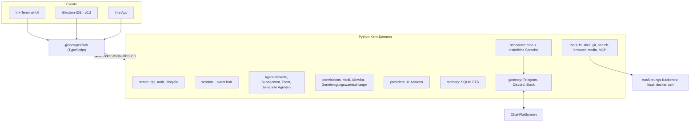

<h1 align="center">snowpea 🌱</h1>

<p align="center"><b>Ein Open-Source-Coding-Agent für mehrere Anbieter — und Ihr eigener persönlicher KI-Assistent.</b></p>

<p align="center">
  <a href="README.md">English</a> ·
  <a href="README.ko.md">한국어</a> ·
  <a href="README.ja.md">日本語</a> ·
  <a href="README.zh-CN.md">简体中文</a> ·
  <a href="README.zh-TW.md">繁體中文</a> ·
  <a href="README.es.md">Español</a> ·
  <a href="README.fr.md">Français</a> ·
  <a href="README.de.md">Deutsch</a> ·
  <a href="README.pt-BR.md">Português (BR)</a> ·
  <a href="README.ru.md">Русский</a>
</p>

<p align="center">
  <a href="LICENSE"></a>
  
  
  <a href="https://github.com/Wafour-Developer/snowpea-agent/actions/workflows/ci.yml"></a>
</p>

---

snowpea ist ein Coding-Agent, der auf Ihrem eigenen Rechner läuft und nur dem Modell antwortet, für das Sie bezahlen. Ein Python-Kern läuft als lokaler Daemon und besitzt Sitzungen, Tools, Berechtigungen, Gedächtnis, Zeitpläne und Messenger-Anbindungen; eine mit Ink gebaute Terminal-UI verbindet sich über ein dokumentiertes WebSocket-JSON-RPC-Protokoll mit diesem Daemon; und ein TypeScript-SDK öffnet dasselbe Protokoll für alles andere, das Sie darauf aufbauen möchten. Elf LLM-Anbieter, lokale/Docker/SSH-Ausführung, Langzeitgedächtnis, ein Cron-Scheduler und Telegram/Discord/Slack-Gateways sitzen alle hinter einem einzigen Befehl: `snowpea`. Weil der Agent weiterläuft, nachdem Sie das Terminal geschlossen haben, ist er tagsüber ein Coding-Agent und den Rest der Zeit ein persönlicher Assistent.

<table>
<tr><td><b>Bringen Sie Ihr eigenes Modell mit</b></td><td>Elf Anbieter hinter einer Schnittstelle — Anthropic, OpenAI, OpenRouter, Gemini, xAI, GLM, MiniMax, Kimi, DeepSeek, Qwen und jeder OpenAI-kompatible Endpunkt, den Sie selbst betreiben. Pro Sitzung wechselbar, ohne Codeänderungen.</td></tr>
<tr><td><b>Ein Berechtigungsmodell, mit dem man leben kann</b></td><td>Drei Modi — plan, accept (Standard), auto. Lesen und Bearbeiten laufen durch; Shell, Netzwerk und Versand fragen nach. Eine Allowlist macht aus lästig gewordenen Nachfragen stille Genehmigungen, pro Projekt oder global.</td></tr>
<tr><td><b>Ein echtes Protokoll, keine private Hintertür</b></td><td>Jede Fähigkeit ist erst eine JSON-RPC-Methode, bevor sie zu einer UI wird. Das Schema wird aus einer einzigen Python-Datei nach <a href="docs/protocol.md">docs/protocol.md</a> und <code>sdk/src/protocol.ts</code> generiert, und CI schlägt fehl, wenn beide auseinanderlaufen.</td></tr>
<tr><td><b>Delegiert und parallelisiert</b></td><td>Einmalige Subagenten laufen gleichzeitig unter einem konfigurierbaren Limit, der Team-Modus gibt jedem Worker sein eigenes git-Worktree und führt deren Branches zusammen, und benannte Agenten überdauern Daemon-Neustarts mit eigenem Gedächtnis und eigenen Kanälen.</td></tr>
<tr><td><b>Erinnert sich über Sitzungen hinweg</b></td><td>SQLite-FTS-Langzeitgedächtnis plus ein Nutzerprofil. Relevante Erinnerungen werden in den System-Prompt eingespeist und in der Antwort per id zitiert.</td></tr>
<tr><td><b>Arbeitet auch, wenn Sie weg sind</b></td><td>Ein Cron- und Natursprache-Scheduler läuft im Daemon und liefert Ergebnisse an Telegram, Discord oder Slack. Genehmigungen kommen als Buttons in denselben Chat und verfallen zu einer Ablehnung, wenn niemand antwortet.</td></tr>
<tr><td><b>Läuft dort, wo der Code ist</b></td><td>Dieselbe Tool-Suite läuft lokal, in einem Docker-Container oder per SSH auf einem anderen Rechner. Mitten in der Sitzung wechselbar mit <code>/backend</code>.</td></tr>
<tr><td><b>Spricht Claude-Code-Plugin</b></td><td>Installiert Plugins, die für Claude Code geschrieben wurden — <code>plugin.json</code>, <code>SKILL.md</code>-Skills, Agent- und Befehls-Markdown, Hooks, <code>.mcp.json</code>-Server — und durchsucht drei Marktplätze mit einem Befehl.</td></tr>
</table>

---

## Schnellinstallation

**macOS, Linux, WSL2**

```bash
curl -fsSL https://raw.githubusercontent.com/Wafour-Developer/snowpea-agent/main/installer/install.sh | sh
```

**Windows (PowerShell)**

```powershell
iwr https://raw.githubusercontent.com/Wafour-Developer/snowpea-agent/main/installer/install.ps1 | iex
```

Der Installer richtet [uv](https://docs.astral.sh/uv/) und Node 20+ ein, falls sie fehlen, installiert den Befehl `snowpea` und gibt die Version aus, bei der er gelandet ist. Nichts läuft im Hintergrund, bis Sie es starten. Den manuellen Weg und was bei einem fehlgeschlagenen Schritt zu tun ist, finden Sie in [docs/manual/en/install.md](docs/manual/en/install.md).

## Schnellstart

```bash
snowpea setup                      # Anbieter wählen, Schlüssel einfügen oder per Browser einloggen
snowpea                            # Terminal-UI öffnen
snowpea -c "was macht dieses Repository?"   # ein headless-Durchgang, dann beenden
```

`snowpea setup` schreibt `$SNOWPEA_HOME/settings.json` (standardmäßig `~/.snowpea`). `snowpea` startet den Daemon, falls er nicht bereits läuft, und hängt die TUI daran; ein zweites `snowpea` in einem anderen Terminal nutzt denselben Daemon wieder. `snowpea -c` überspringt die UI vollständig und ist die Form, die Sie in Skripten und CI wollen:

```bash
snowpea -c "füge einen Regressionstest für den Parser hinzu" --mode auto
snowpea -c "fasse den heutigen Diff zusammen" --json --cwd ~/src/myproject
```

Headless-Läufe streamen `session.event`-Datensätze als JSON Lines unter `--json` und enden mit einem deterministischen Exit-Code: `0` fertig, `1` der Agent hat aufgegeben, `2` Bedienungsfehler, `3` kein Daemon, `4` abgelehnt oder vom Modus blockiert, `5` Zeitüberschreitung. Details in [headless.md](docs/manual/en/headless.md).

## Architektur



Der Daemon bindet beim Start einen Loopback-Port und schreibt ihn samt Token in `$SNOWPEA_HOME/daemon.json`. Drei rein lesende HTTP-Endpunkte (`/health`, `/version`, `/protocol.json`) sitzen auf demselben Port für Probes; jeder zustandsändernde Aufruf läuft ausschließlich über WebSocket. [ARCHITECTURE.md](docs/ARCHITECTURE.md) zeigt die Module, und [docs/protocol.md](docs/protocol.md) ist die generierte Referenz.

## Anbieter

Elf Anbieter sind in v0.1 enthalten. Zwei unterstützen einen Browser-Login; die übrigen benötigen einen API-Schlüssel.

| Anbieter | Adapter | Login |
|---|---|---|
| Anthropic | native Messages API | API-Schlüssel |
| OpenAI | OpenAI-kompatibel | API-Schlüssel oder **Browser-Login** (Device Code) |
| OpenRouter | OpenAI-kompatibel | API-Schlüssel oder **Browser-Login** (OAuth PKCE) |
| Google Gemini | nativ | API-Schlüssel |
| xAI Grok | OpenAI-kompatibel | API-Schlüssel |
| Zhipu GLM | OpenAI-kompatibel | API-Schlüssel |
| MiniMax | OpenAI-kompatibel | API-Schlüssel |
| Moonshot Kimi | OpenAI-kompatibel | API-Schlüssel |
| DeepSeek | OpenAI-kompatibel | API-Schlüssel |
| Qwen | OpenAI-kompatibel | API-Schlüssel |
| Lokal OpenAI-kompatibel (vLLM, Ollama, LM Studio) | OpenAI-kompatibel | Basis-URL, Schlüssel optional |

```bash
snowpea provider list                          # was verfügbar ist und was konfiguriert ist
snowpea provider login openai                  # Device Code im Terminal, Bestätigung im Browser
snowpea setup --vendor deepseek --key sk-...   # nicht-interaktiv
```

Anbieter unterscheiden sich in der Form der Tool-Calls, den Streaming-Deltas und der Unterstützung paralleler Tool-Aufrufe. All das wird an einer einzigen Stelle normalisiert und pro Anbieter als Preset-Flags deklariert, sodass das Hinzufügen eines zwölften Anbieters ein Preset-Eintrag ist, kein neuer Codepfad. Siehe [setup.md](docs/manual/en/setup.md).

## Modi und Genehmigungen

| | Lesen | Schreiben / Bearbeiten | Shell | Netzwerk | Versand |
|---|---|---|---|---|---|
| **plan** | erlaubt | verweigert | verweigert | erlaubt | verweigert |
| **accept** (Standard) | erlaubt | erlaubt | fragt | fragt | fragt |
| **auto** | erlaubt | erlaubt | erlaubt | erlaubt | erlaubt |

Wechseln Sie mit `/plan`, `/accept`, `/auto` in der UI, mit `--mode` auf der Kommandozeile, oder speichern Sie einen Projekt-Standard mit `/mode save` dauerhaft in `<project>/.snowpea/settings.json`. Wenn eine Nachfrage lästig wird, heben Sie sie hoch:

```
/allow ^ls( .*)?$
/allow ^git (status|diff|log)\b --global
```

Ein Allowlist-Eintrag macht immer nur aus *fragt* ein *erlaubt*; er kann niemals etwas freigeben, das der Modus verweigert. Alles, was genehmigt oder abgelehnt wird, wird an `$SNOWPEA_HOME/logs/approvals.jsonl` angehängt. Mehr dazu in [modes.md](docs/manual/en/modes.md).

## Eingebaute Befehle

```
/help        /tools       /mode        /allow       /allowlist    /backend
/plan        /accept      /auto        /approvals   /schedule
/agent       /skill       /ralph       /ultrawork   /deepinit
/deep-interview           /deep-research            /ralplan
```

- **`/ralph <task>`** schreibt eine kleine PRD aus User Stories mit Abnahmekriterien und läuft dann in einer Schleife — implementieren mit Subagenten, die von der Story genannten Verifizierungsbefehle ausführen, als bestanden markieren — bis ein Reviewer-Subagent mit APPROVE antwortet.
- **`/ultrawork <task>`** teilt eine Aufgabe in unabhängige Teile, verteilt sie auf gleichzeitig laufende Subagenten und führt die Berichte zusammen.
- **`/deepinit`** durchläuft das Repository und schreibt hierarchische `AGENTS.md`-Dokumentation.
- **`/deep-interview`**, **`/deep-research`** und **`/ralplan`** werden als `SKILL.md`-Dateien ausgeliefert, geladen über denselben Loader, den auch Ihre eigenen Skills verwenden, sodass Sie deren Prompts lesen und bearbeiten können.
- **`/agent create "<description>"`** erzeugt eine Agent-Definition in `<project>/.snowpea/agents/<name>.md`, sofort nutzbar als `delegate_task`-Ziel. **`/skill learn`** verwandelt die gerade abgeschlossene Sitzung in eine wiederverwendbare `SKILL.md`.
- **`/team <n> <task>`** gibt jedem von n Workern ein git-Worktree und führt deren Branches zusammen, sobald Aufgaben fertig sind.

Slash-Befehle leben im Kern, nicht in der UI, sodass derselbe `/ralph` aus der TUI läuft, aus `snowpea -c "/ralph ..."`, aus einem geplanten Job und aus einer Chat-Nachricht. `snowpea commands list --json` gibt das aktuelle Register aus. Vollständige Referenz: [commands.md](docs/manual/en/commands.md).

## Plugins und Skills

snowpea liest das Claude-Code-Plugin-Layout unverändert: `plugin.json`, `skills/<name>/SKILL.md`, `agents/*.md`, `commands/*.md`, `hooks/hooks.json` und `.mcp.json`-Server. Die Front Matter eines Skills folgt dem [agentskills.io](https://agentskills.io)-Standard, und sein Textkörper wird zu einem `/`-Befehl.

```bash
snowpea skill search "pdf"           # durchsucht claude-marketplace, agentskills.io und hermes-hub
snowpea skill install oh-my-claudecode
snowpea skill list
```

Sowohl projektlokale `<project>/.snowpea/`- als auch `<project>/.claude/`-Verzeichnisse werden durchsucht, sodass ein Repository, das bereits für Claude Code eingerichtet ist, ohne Änderungen funktioniert. [plugins.md](docs/manual/en/plugins.md) behandelt Priorität, Hooks und MCP-Server.

## Scheduler und Messenger-Gateway

```bash
snowpea job schedule --at "0 9 * * *" --task "fasse die gestrigen Commits zusammen" --channel telegram:123456
snowpea job list
snowpea gateway bind telegram TELEGRAM_BOT_TOKEN agent:scribe --user 987654
```

Jobs laufen im Daemon, in dem Modus, mit dem Sie sie registriert haben, und liefern die Antwort an den benannten Kanal. Spezifikationen können Cron sein, `in 10m`, `every 30m`, oder natürliche Sprache auf Englisch oder Koreanisch. Wenn ein unbeaufsichtigter Lauf eine Genehmigung benötigt, trifft sie im gebundenen Chat mit Erlauben/Ablehnen-Buttons ein, erscheint gleichzeitig in der TUI-Genehmigungswarteschlange, akzeptiert die Antwort, die zuerst kommt, und verfällt nach `approvals.timeoutSec` (standardmäßig 300) zu einer Ablehnung. Nur die gebundene Nutzer-id darf genehmigen. Siehe [scheduler.md](docs/manual/en/scheduler.md) und [gateway.md](docs/manual/en/gateway.md).

## Ausführungs-Backends

Die Tool-Suite ist identisch, egal ob sie auf Ihrem Rechner, in einem Container oder auf einem entfernten Host läuft — Tools laufen immer über das Backend, nie direkt auf das Dateisystem.

```
/backend docker {"image": "python:3.11-slim"}
/backend ssh {"host": "10.0.0.5", "user": "build", "key": "~/.ssh/id_ed25519"}
/backend local
```

[backends.md](docs/manual/en/backends.md) enthält die Konfiguration für jedes.

## Wie es sich vergleicht

| | snowpea | Claude Code | Codex CLI | opencode | Hermes |
|---|---|---|---|---|---|
| Lizenz | MIT | proprietär | Open Source | Open Source | MIT |
| Anbieter | 11, eine Schnittstelle | Anthropic | OpenAI-zentriert | viele | viele |
| Client-Protokoll | WS JSON-RPC, dokumentiert, TS-SDK | intern | app-server JSON-RPC | HTTP + SSE | intern |
| Berechtigungsmodi | plan / accept / auto + Allowlist | plan / acceptEdits / bypass | Genehmigungsrichtlinien | Berechtigungskonfiguration | Befehlsgenehmigung |
| Plugin-Format | Claude-Code-Plugins + SKILL.md | Claude-Code-Plugins | — | TypeScript-Plugins | agentskills.io-Skills |
| Messenger-Gateway | Telegram, Discord, Slack | — | — | — | sechs Plattformen |
| Scheduler | Cron + natürliche Sprache, im Daemon | — | — | — | Cron |
| Ausführungs-Backends | local, Docker, SSH | local | local, Sandbox | local | sieben Backends |
| Team-Modus | geteilte Aufgabenliste + git-Worktrees | Subagenten | — | — | Subagenten |

Die Zeilen beschreiben snowpea v0.1 im Vergleich zu diesen Projekten zum Zeitpunkt der Erstellung; die anderen Projekte entwickeln sich schnell weiter, prüfen Sie also deren eigene Dokumentation, bevor Sie sich auf eine Zelle verlassen.

## Dokumentation

| Seite | Was drinsteht |
|---|---|
| [Installation](docs/manual/en/install.md) | Einzeiler, manuelle Installation, Aktualisieren, Deinstallieren |
| [Setup](docs/manual/en/setup.md) | Assistenten-Bildschirme, alle elf Anbieter, Browser-Login, Such- und Browser-Provider |
| [Modi](docs/manual/en/modes.md) | plan/accept/auto, die Berechtigungsmatrix, Allowlist, Projekteinstellungen |
| [Befehle](docs/manual/en/commands.md) | jeder eingebaute Befehl und CLI-Unterbefehl |
| [Plugins](docs/manual/en/plugins.md) | Claude-Code-Plugin-Format, SKILL.md, Hooks, MCP, Marktplätze |
| [Scheduler](docs/manual/en/scheduler.md) | Cron- und Natursprache-Jobs, Zustellkanäle |
| [Gateway](docs/manual/en/gateway.md) | Telegram, Discord, Slack, unbeaufsichtigte Genehmigungen |
| [Backends](docs/manual/en/backends.md) | local, Docker, SSH |
| [Headless](docs/manual/en/headless.md) | `-c`, JSON Lines, Exit-Codes, CI-Nutzung |
| [Protokoll](docs/manual/en/protocol.md) | Handshake, Methoden, Events, Versionierung |
| [Architektur](docs/ARCHITECTURE.md) | Modulübersicht, Diagramme, Protokoll-Freeze-Gate |
| [Mitwirken](docs/CONTRIBUTING.md) | Entwicklungs-Setup, Tests, einen Anbieter, ein Tool oder einen Befehl hinzufügen |

Das Handbuch ist außerdem auf [Koreanisch](docs/manual/ko/index.md) verfügbar, und seine Seiten zu Installation/Setup/Befehlen auf [Japanisch](docs/manual/ja/install.md), [vereinfachtem Chinesisch](docs/manual/zh-CN/install.md) und [Spanisch](docs/manual/es/install.md). Index aller Seiten und Sprachen: [docs/manual/README.md](docs/manual/README.md).

## Roadmap

- **v0.1 — dieses Repository.** Kern-Daemon, Protokoll, TUI, SDK, elf Anbieter, Tools, Gedächtnis, Scheduler, Gateway, Plugins, Subagenten und Team-Modus, Installer für drei Plattformen.
- **v0.2 — Desktop-IDE.** Eine Electron-App auf demselben SDK, mit Diff-Genehmigung pro Datei, einem Subagenten-Baum, worktree-parallelen Sitzungen und einem Skill-Browser. Der Start erfolgt erst, nachdem das Protokoll sein v1.0-Freeze-Gate besteht: drei aufeinanderfolgende Releases ohne Änderung am generierten Schema.
- **v0.3 — Website und Registry.** snowpea.ai für die Landingpage und das Handbuch, dazu eine Skill-Registry mit Upload, Bewertungen und Kuratierung, angebunden an `snowpea skill search`. Die Installations-URL wechselt zu diesem Zeitpunkt von GitHub raw zu snowpea.ai.

## Mitwirken

```bash
git clone https://github.com/Wafour-Developer/snowpea-agent.git
cd snowpea-agent
uv sync && npm ci
uv run pytest -q
```

Lesen Sie [docs/CONTRIBUTING.md](docs/CONTRIBUTING.md) ([한국어](docs/CONTRIBUTING.ko.md)), bevor Sie Ihren ersten Pull Request stellen — es behandelt die Prüfung des generierten Protokolls, die Integritätsprüfung des vendorierten Codes und wo neue Anbieter, Tools, Befehle und Such-Provider andocken.

## Lizenz und Danksagungen

snowpea steht unter der MIT-Lizenz ([LICENSE](LICENSE)).

Es steht auf zwei MIT-lizenzierten Projekten. Teile der Tool-Suite und die praktische Mechanik hinter Gateways, Scheduling und Gedächtnis sind aus [hermes-agent](https://github.com/NousResearch/hermes-agent) von Nous Research vendoriert; mehrere eingebaute Befehle und Skills sind aus [oh-my-claudecode](https://github.com/Yeachan-Heo/oh-my-claudecode) portiert. Vendorierter Code liegt unter `core/snowpea_core/vendor/hermes/`, behält seinen Upstream-Header und ist per Upstream-Commit und Datei-Hash fixiert — unsere eigenen Änderungen werden als Patches committet, und CI verifiziert, dass Upstream plus Patch der Arbeitskopie entspricht. Die maßgeblichen Tabellen sind [docs/vendoring-map.md](docs/vendoring-map.md) und [docs/omc-porting-map.md](docs/omc-porting-map.md); die Attribution steht in [NOTICE](NOTICE).
