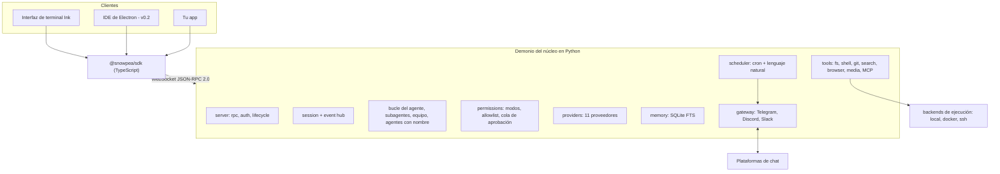

<h1 align="center">snowpea 🌱</h1>

<p align="center"><b>Un agente de codificación de código abierto y multiproveedor — y tu propio asistente de IA.</b></p>

<p align="center">
  <a href="README.md">English</a> ·
  <a href="README.ko.md">한국어</a> ·
  <a href="README.ja.md">日本語</a> ·
  <a href="README.zh-CN.md">简体中文</a> ·
  <a href="README.zh-TW.md">繁體中文</a> ·
  <a href="README.es.md">Español</a> ·
  <a href="README.fr.md">Français</a> ·
  <a href="README.de.md">Deutsch</a> ·
  <a href="README.pt-BR.md">Português (BR)</a> ·
  <a href="README.ru.md">Русский</a>
</p>

<p align="center">
  <a href="LICENSE"></a>
  
  
  <a href="https://github.com/Wafour-Developer/snowpea-agent/actions/workflows/ci.yml"></a>
</p>

---

snowpea es un agente de codificación que se ejecuta en tu propia máquina y responde solo ante el modelo que tú pagas. Un núcleo en Python se ejecuta como un demonio local que posee las sesiones, herramientas, permisos, memoria, programaciones y enlaces de mensajería; una interfaz de terminal hecha con Ink se conecta a él mediante un protocolo WebSocket JSON-RPC documentado; y un SDK de TypeScript abre ese mismo protocolo a cualquier otra cosa que quieras construir. Once proveedores de LLM, ejecución local/Docker/SSH, memoria a largo plazo, un programador cron y pasarelas de Telegram/Discord/Slack conviven detrás de un solo comando: `snowpea`. Como el agente sigue funcionando después de que cierras la terminal, es un agente de codificación durante el día y un asistente personal el resto del tiempo.

<table>
<tr><td><b>Usa el modelo que ya tienes</b></td><td>Once proveedores detrás de una sola interfaz — Anthropic, OpenAI, OpenRouter, Gemini, xAI, GLM, MiniMax, Kimi, DeepSeek, Qwen, y cualquier endpoint compatible con OpenAI que aloje tú mismo. Cambia por sesión, sin tocar código.</td></tr>
<tr><td><b>Un modelo de permisos con el que puedes convivir</b></td><td>Tres modos — plan, accept (el predeterminado), auto. Las lecturas y ediciones fluyen; el shell, la red y los envíos preguntan. Una lista de permitidos convierte las confirmaciones que te cansan en aprobaciones silenciosas, por proyecto o de forma global.</td></tr>
<tr><td><b>Un protocolo real, no una puerta trasera privada</b></td><td>Cada capacidad es un método JSON-RPC antes de ser una interfaz. El esquema se genera desde un único archivo Python hacia <a href="docs/protocol.md">docs/protocol.md</a> y <code>sdk/src/protocol.ts</code>, y el CI falla si se desincronizan.</td></tr>
<tr><td><b>Delega y paraleliza</b></td><td>Los subagentes de un solo uso se ejecutan de forma concurrente bajo un límite configurable, el modo equipo le da a cada trabajador su propio git worktree y fusiona sus ramas, y los agentes con nombre persisten a través de reinicios del demonio con su propia memoria y canales.</td></tr>
<tr><td><b>Recuerda entre sesiones</b></td><td>Memoria a largo plazo con SQLite FTS más un perfil de usuario. Los recuerdos relevantes se inyectan en el prompt del sistema y se citan por id en la respuesta.</td></tr>
<tr><td><b>Trabaja mientras no estás</b></td><td>Un programador de cron y lenguaje natural se ejecuta dentro del demonio y entrega los resultados a Telegram, Discord o Slack. Las aprobaciones llegan al mismo chat como botones, y expiran en una denegación si nadie responde.</td></tr>
<tr><td><b>Se ejecuta donde está el código</b></td><td>El mismo conjunto de herramientas se ejecuta localmente, dentro de un contenedor Docker, o por SSH en otra máquina. Cambia a mitad de sesión con <code>/backend</code>.</td></tr>
<tr><td><b>Habla el idioma de los plugins de Claude Code</b></td><td>Instala plugins escritos para Claude Code — <code>plugin.json</code>, skills <code>SKILL.md</code>, markdown de agentes y comandos, hooks, servidores <code>.mcp.json</code> — y busca en tres mercados desde un solo comando.</td></tr>
</table>

---

## Instalación rápida

**macOS, Linux, WSL2**

```bash
curl -fsSL https://raw.githubusercontent.com/Wafour-Developer/snowpea-agent/main/installer/install.sh | sh
```

**Windows (PowerShell)**

```powershell
iwr https://raw.githubusercontent.com/Wafour-Developer/snowpea-agent/main/installer/install.ps1 | iex
```

El instalador coloca [uv](https://docs.astral.sh/uv/) y Node 20+ si faltan, instala el comando `snowpea`, e imprime la versión con la que terminó. Nada se ejecuta en segundo plano hasta que tú lo inicies. Consulta [docs/manual/en/install.md](docs/manual/en/install.md) para la ruta manual y qué hacer cuando un paso falla.

## Inicio rápido

```bash
snowpea setup                      # elige un proveedor, pega una clave o inicia sesión desde el navegador
snowpea                            # abre la interfaz de terminal
snowpea -c "¿qué hace este repositorio?"   # un turno sin interfaz, luego sale
```

`snowpea setup` escribe `$SNOWPEA_HOME/settings.json` (`~/.snowpea` por defecto). `snowpea` inicia el demonio si no está ya en ejecución y conecta la TUI a él; un segundo `snowpea` en otra terminal reutiliza el mismo demonio. `snowpea -c` omite la interfaz por completo y es la forma que quieres usar en scripts y CI:

```bash
snowpea -c "añade una prueba de regresión para el parser" --mode auto
snowpea -c "resume el diff de hoy" --json --cwd ~/src/myproject
```

Las ejecuciones sin interfaz transmiten registros `session.event` como JSON Lines con `--json` y terminan con un código de salida determinista: `0` completado, `1` el agente se rindió, `2` error de uso, `3` sin demonio, `4` denegado o bloqueado por el modo, `5` tiempo agotado. Más detalles en [headless.md](docs/manual/en/headless.md).

## Arquitectura



El demonio vincula un puerto de loopback elegido al arrancar y lo registra, junto con un token, en `$SNOWPEA_HOME/daemon.json`. Tres endpoints HTTP de solo lectura (`/health`, `/version`, `/protocol.json`) conviven en el mismo puerto para sondeos; toda llamada que cambia el estado es exclusivamente WebSocket. [ARCHITECTURE.md](docs/ARCHITECTURE.md) mapea los módulos, y [docs/protocol.md](docs/protocol.md) es la referencia generada.

## Proveedores

Once proveedores se incluyen en v0.1. Dos admiten inicio de sesión por navegador; el resto usa una clave de API.

| Proveedor | Adaptador | Inicio de sesión |
|---|---|---|
| Anthropic | API de Messages nativa | Clave de API |
| OpenAI | Compatible con OpenAI | Clave de API o **inicio de sesión por navegador** (código de dispositivo) |
| OpenRouter | Compatible con OpenAI | Clave de API o **inicio de sesión por navegador** (OAuth PKCE) |
| Google Gemini | Nativo | Clave de API |
| xAI Grok | Compatible con OpenAI | Clave de API |
| Zhipu GLM | Compatible con OpenAI | Clave de API |
| MiniMax | Compatible con OpenAI | Clave de API |
| Moonshot Kimi | Compatible con OpenAI | Clave de API |
| DeepSeek | Compatible con OpenAI | Clave de API |
| Qwen | Compatible con OpenAI | Clave de API |
| Compatible con OpenAI local (vLLM, Ollama, LM Studio) | Compatible con OpenAI | URL base, clave opcional |

```bash
snowpea provider list                          # qué hay disponible y qué está configurado
snowpea provider login openai                  # código de dispositivo en la terminal, aprueba en el navegador
snowpea setup --vendor deepseek --key sk-...   # no interactivo
```

Los proveedores difieren en la forma de las llamadas a herramientas, los deltas de streaming y el soporte de herramientas en paralelo. Todo eso se normaliza en un solo lugar y se declara por proveedor como banderas preestablecidas, así que añadir un duodécimo proveedor es una entrada de preset, no una nueva ruta de código. Consulta [setup.md](docs/manual/en/setup.md).

## Modos y aprobaciones

| | lectura | escritura / edición | shell | red | envío |
|---|---|---|---|---|---|
| **plan** | permitir | denegar | denegar | permitir | denegar |
| **accept** (predeterminado) | permitir | permitir | preguntar | preguntar | preguntar |
| **auto** | permitir | permitir | permitir | permitir | permitir |

Cambia con `/plan`, `/accept`, `/auto` en la interfaz, con `--mode` en la línea de comandos, o guarda un valor predeterminado por proyecto con `/mode save` en `<project>/.snowpea/settings.json`. Cuando una confirmación se vuelve repetitiva, promuévela:

```
/allow ^ls( .*)?$
/allow ^git (status|diff|log)\b --global
```

Una entrada de allowlist solo convierte *preguntar* en *permitir*; nunca puede desbloquear algo que el modo deniega. Todo lo aprobado o denegado se añade a `$SNOWPEA_HOME/logs/approvals.jsonl`. Más en [modes.md](docs/manual/en/modes.md).

## Comandos incorporados

```
/help        /tools       /mode        /allow       /allowlist    /backend
/plan        /accept      /auto        /approvals   /schedule
/agent       /skill       /ralph       /ultrawork   /deepinit
/deep-interview           /deep-research            /ralplan
```

- **`/ralph <task>`** escribe un pequeño PRD de historias de usuario con criterios de aceptación, y luego repite el ciclo — implementar con subagentes, ejecutar los comandos de verificación que la historia indica, marcarla como aprobada — hasta que un subagente revisor responde APPROVE.
- **`/ultrawork <task>`** divide una tarea en partes independientes, las reparte entre subagentes concurrentes y fusiona los informes.
- **`/deepinit`** recorre el repositorio y escribe documentación jerárquica en `AGENTS.md`.
- **`/deep-interview`**, **`/deep-research`** y **`/ralplan`** se distribuyen como archivos `SKILL.md` cargados a través del mismo cargador que usan tus propias skills, así que puedes leer y editar sus prompts.
- **`/agent create "<description>"`** genera una definición de agente en `<project>/.snowpea/agents/<name>.md`, utilizable de inmediato como destino de `delegate_task`. **`/skill learn`** convierte la sesión que acabas de terminar en un `SKILL.md` reutilizable.
- **`/team <n> <task>`** le da a cada uno de n trabajadores un git worktree y fusiona sus ramas conforme las tareas terminan.

Los comandos slash viven en el núcleo, no en la interfaz, así que el mismo `/ralph` se ejecuta desde la TUI, desde `snowpea -c "/ralph ..."`, desde un trabajo programado y desde un mensaje de chat. `snowpea commands list --json` imprime el registro en vivo. Referencia completa: [commands.md](docs/manual/en/commands.md).

## Plugins y skills

snowpea lee la estructura de plugins de Claude Code tal cual: `plugin.json`, `skills/<name>/SKILL.md`, `agents/*.md`, `commands/*.md`, `hooks/hooks.json`, y servidores `.mcp.json`. El front matter de una skill sigue el estándar [agentskills.io](https://agentskills.io), y su cuerpo se convierte en un comando `/`.

```bash
snowpea skill search "pdf"           # busca en claude-marketplace, agentskills.io y hermes-hub
snowpea skill install oh-my-claudecode
snowpea skill list
```

Se escanean tanto los directorios locales del proyecto `<project>/.snowpea/` como `<project>/.claude/`, así que un repositorio ya configurado para Claude Code funciona sin cambios. [plugins.md](docs/manual/en/plugins.md) cubre precedencia, hooks y servidores MCP.

## Programador y pasarela de mensajería

```bash
snowpea job schedule --at "0 9 * * *" --task "resume los commits de ayer" --channel telegram:123456
snowpea job list
snowpea gateway bind telegram TELEGRAM_BOT_TOKEN agent:scribe --user 987654
```

Los trabajos se ejecutan dentro del demonio, en el modo con el que los registraste, y entregan la respuesta al canal que nombraste. Las especificaciones pueden ser cron, `in 10m`, `every 30m`, o lenguaje natural en inglés o coreano. Cuando una ejecución desatendida necesita una aprobación, esta llega al chat vinculado con botones de permitir/denegar, aparece simultáneamente en la cola de aprobaciones de la TUI, acepta la respuesta que llegue primero, y expira en una denegación tras `approvals.timeoutSec` (300 por defecto). Solo el id de usuario vinculado puede aprobar. Consulta [scheduler.md](docs/manual/en/scheduler.md) y [gateway.md](docs/manual/en/gateway.md).

## Backends de ejecución

El conjunto de herramientas es idéntico ya sea que se ejecute en tu máquina, en un contenedor o en un host remoto — las herramientas siempre pasan por el backend, nunca directamente al sistema de archivos.

```
/backend docker {"image": "python:3.11-slim"}
/backend ssh {"host": "10.0.0.5", "user": "build", "key": "~/.ssh/id_ed25519"}
/backend local
```

[backends.md](docs/manual/en/backends.md) tiene la configuración de cada uno.

## Cómo se compara

| | snowpea | Claude Code | Codex CLI | opencode | Hermes |
|---|---|---|---|---|---|
| Licencia | MIT | propietaria | código abierto | código abierto | MIT |
| Proveedores | 11, una interfaz | Anthropic | centrado en OpenAI | muchos | muchos |
| Protocolo de cliente | WS JSON-RPC, documentado, SDK de TS | interno | JSON-RPC de app-server | HTTP + SSE | interno |
| Modos de permiso | plan / accept / auto + allowlist | plan / acceptEdits / bypass | políticas de aprobación | configuración de permisos | aprobación de comandos |
| Formato de plugin | plugins de Claude Code + SKILL.md | plugins de Claude Code | — | plugins de TypeScript | skills de agentskills.io |
| Pasarela de mensajería | Telegram, Discord, Slack | — | — | — | seis plataformas |
| Programador | cron + lenguaje natural, en el demonio | — | — | — | cron |
| Backends de ejecución | local, Docker, SSH | local | local, sandbox | local | siete backends |
| Modo equipo | lista de tareas compartida + git worktrees | subagentes | — | — | subagentes |

Las filas describen snowpea v0.1 frente a estos proyectos al momento de escribir esto; los demás proyectos avanzan rápido, así que consulta su propia documentación antes de confiar en una celda.

## Documentación

| Página | Qué contiene |
|---|---|
| [Instalación](docs/manual/en/install.md) | instalación en una línea, instalación manual, actualización, desinstalación |
| [Configuración](docs/manual/en/setup.md) | pantallas del asistente, los once proveedores, inicio de sesión por navegador, proveedores de búsqueda y navegador |
| [Modos](docs/manual/en/modes.md) | plan/accept/auto, la matriz de permisos, allowlist, configuración de proyecto |
| [Comandos](docs/manual/en/commands.md) | todos los comandos incorporados y subcomandos de la CLI |
| [Plugins](docs/manual/en/plugins.md) | formato de plugin de Claude Code, SKILL.md, hooks, MCP, mercados |
| [Programador](docs/manual/en/scheduler.md) | trabajos cron y en lenguaje natural, canales de entrega |
| [Pasarela](docs/manual/en/gateway.md) | Telegram, Discord, Slack, aprobaciones desatendidas |
| [Backends](docs/manual/en/backends.md) | local, Docker, SSH |
| [Sin interfaz](docs/manual/en/headless.md) | `-c`, JSON Lines, códigos de salida, uso en CI |
| [Protocolo](docs/manual/en/protocol.md) | negociación, métodos, eventos, versionado |
| [Arquitectura](docs/ARCHITECTURE.md) | mapa de módulos, diagramas, puerta de congelación del protocolo |
| [Contribuir](docs/CONTRIBUTING.md) | configuración de desarrollo, pruebas, añadir un proveedor, herramienta o comando |

El manual también está disponible en [coreano](docs/manual/ko/index.md), y sus páginas de instalación/configuración/comandos en [japonés](docs/manual/ja/install.md), [chino simplificado](docs/manual/zh-CN/install.md) y [español](docs/manual/es/install.md). Índice de todas las páginas e idiomas: [docs/manual/README.md](docs/manual/README.md).

## Hoja de ruta

- **v0.1 — este repositorio.** Demonio del núcleo, protocolo, TUI, SDK, once proveedores, herramientas, memoria, programador, pasarela, plugins, subagentes y modo equipo, instaladores para tres plataformas.
- **v0.2 — IDE de escritorio.** Una app de Electron sobre el mismo SDK, con aprobación de diff por archivo, un árbol de subagentes, sesiones paralelas por worktree y un navegador de skills. Comienza solo después de que el protocolo supere su puerta de congelación v1.0: tres lanzamientos consecutivos sin cambios en el esquema generado.
- **v0.3 — sitio y registro.** snowpea.ai para la página de aterrizaje y el manual, más un registro de skills con carga, valoraciones y curación conectado a `snowpea skill search`. La URL de instalación pasa de GitHub raw a snowpea.ai en ese momento.

## Contribuir

```bash
git clone https://github.com/Wafour-Developer/snowpea-agent.git
cd snowpea-agent
uv sync && npm ci
uv run pytest -q
```

Lee [docs/CONTRIBUTING.md](docs/CONTRIBUTING.md) ([한국어](docs/CONTRIBUTING.ko.md)) antes de tu primer pull request — cubre la verificación del protocolo generado, la verificación de integridad del código vendorizado, y dónde se conectan los nuevos proveedores, herramientas, comandos y proveedores de búsqueda.

## Licencia y créditos

snowpea tiene licencia MIT ([LICENSE](LICENSE)).

Se apoya en dos proyectos con licencia MIT. Parte del conjunto de herramientas y la maquinaria práctica detrás de las pasarelas, la programación y la memoria están vendorizadas desde [hermes-agent](https://github.com/NousResearch/hermes-agent) de Nous Research; varios comandos y skills incorporados están portados desde [oh-my-claudecode](https://github.com/Yeachan-Heo/oh-my-claudecode). El código vendorizado vive bajo `core/snowpea_core/vendor/hermes/`, conserva su encabezado original, y está fijado por commit y hash de archivo de origen — nuestras propias modificaciones se registran como parches y el CI verifica que origen más parche sea igual a la copia de trabajo. Las tablas autorizadas son [docs/vendoring-map.md](docs/vendoring-map.md) y [docs/omc-porting-map.md](docs/omc-porting-map.md); la atribución está en [NOTICE](NOTICE).
