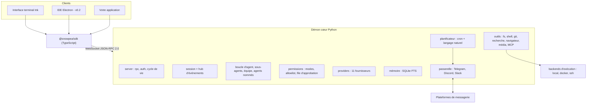

<h1 align="center">snowpea 🌱</h1>

<p align="center"><b>Un agent de codage open source, multi-fournisseur — et votre propre assistant IA.</b></p>

<p align="center">
  <a href="README.md">English</a> ·
  <a href="README.ko.md">한국어</a> ·
  <a href="README.ja.md">日本語</a> ·
  <a href="README.zh-CN.md">简体中文</a> ·
  <a href="README.zh-TW.md">繁體中文</a> ·
  <a href="README.es.md">Español</a> ·
  <a href="README.fr.md">Français</a> ·
  <a href="README.de.md">Deutsch</a> ·
  <a href="README.pt-BR.md">Português (BR)</a> ·
  <a href="README.ru.md">Русский</a>
</p>

<p align="center">
  <a href="LICENSE"></a>
  
  
  <a href="https://github.com/Wafour-Developer/snowpea-agent/actions/workflows/ci.yml"></a>
</p>

---

snowpea est un agent de codage qui tourne sur votre propre machine et ne répond qu'au modèle que vous payez. Un cœur Python s'exécute en tant que démon local qui possède les sessions, les outils, les permissions, la mémoire, les planifications et les connexions aux messageries ; une interface terminal Ink s'y connecte via un protocole WebSocket JSON-RPC documenté ; et un SDK TypeScript ouvre ce même protocole à tout ce que vous voulez construire par-dessus. Onze fournisseurs de LLM, une exécution locale/Docker/SSH, une mémoire à long terme, un planificateur cron et des passerelles Telegram/Discord/Slack tiennent tous derrière une seule commande : `snowpea`. Parce que l'agent continue de tourner après que vous avez fermé le terminal, c'est un agent de codage le jour et un assistant personnel le reste du temps.

<table>
<tr><td><b>Gardez votre propre modèle</b></td><td>Onze fournisseurs derrière une seule interface — Anthropic, OpenAI, OpenRouter, Gemini, xAI, GLM, MiniMax, Kimi, DeepSeek, Qwen, et n'importe quel point de terminaison compatible OpenAI que vous hébergez vous-même. Changez de fournisseur par session, sans modifier de code.</td></tr>
<tr><td><b>Un modèle de permissions vivable</b></td><td>Trois modes — plan, accept (par défaut), auto. Les lectures et les modifications s'enchaînent ; le shell, le réseau et l'envoi demandent une confirmation. Une allowlist transforme les invites qui vous fatiguent en approbations silencieuses, par projet ou globalement.</td></tr>
<tr><td><b>Un vrai protocole, pas une porte dérobée privée</b></td><td>Chaque fonctionnalité est une méthode JSON-RPC avant d'être une interface. Le schéma est généré à partir d'un seul fichier Python vers <a href="docs/protocol.md">docs/protocol.md</a> et <code>sdk/src/protocol.ts</code>, et la CI échoue s'ils divergent.</td></tr>
<tr><td><b>Délègue et parallélise</b></td><td>Des sous-agents ponctuels tournent en parallèle sous une limite configurable, le mode équipe donne à chaque travailleur son propre git worktree et fusionne leurs branches, et les agents nommés survivent aux redémarrages du démon avec leur propre mémoire et leurs propres canaux.</td></tr>
<tr><td><b>Se souvient d'une session à l'autre</b></td><td>Mémoire à long terme SQLite FTS plus un profil utilisateur. Les souvenirs pertinents sont injectés dans le prompt système et cités par id dans la réponse.</td></tr>
<tr><td><b>Travaille en votre absence</b></td><td>Un planificateur cron et en langage naturel tourne dans le démon et livre les résultats sur Telegram, Discord ou Slack. Les approbations arrivent dans la même discussion sous forme de boutons, et expirent en refus si personne ne répond.</td></tr>
<tr><td><b>S'exécute là où se trouve le code</b></td><td>Le même ensemble d'outils s'exécute localement, dans un conteneur Docker, ou via SSH sur une autre machine. Changez en cours de session avec <code>/backend</code>.</td></tr>
<tr><td><b>Parle le langage des plugins Claude Code</b></td><td>Installez des plugins écrits pour Claude Code — <code>plugin.json</code>, skills <code>SKILL.md</code>, markdown d'agents et de commandes, hooks, serveurs <code>.mcp.json</code> — et cherchez dans trois places de marché depuis une seule commande.</td></tr>
</table>

---

## Installation rapide

**macOS, Linux, WSL2**

```bash
curl -fsSL https://raw.githubusercontent.com/Wafour-Developer/snowpea-agent/main/installer/install.sh | sh
```

**Windows (PowerShell)**

```powershell
iwr https://raw.githubusercontent.com/Wafour-Developer/snowpea-agent/main/installer/install.ps1 | iex
```

L'installateur met en place [uv](https://docs.astral.sh/uv/) et Node 20+ s'ils manquent, installe la commande `snowpea`, et affiche la version obtenue. Rien ne tourne en arrière-plan tant que vous ne le démarrez pas. Voir [docs/manual/en/install.md](docs/manual/en/install.md) pour le chemin manuel et la marche à suivre en cas d'échec d'une étape.

## Démarrage rapide

```bash
snowpea setup                      # choisissez un fournisseur, collez une clé ou connectez-vous via le navigateur
snowpea                            # ouvre l'interface terminal
snowpea -c "que fait ce dépôt ?"   # un tour en mode headless, puis quitte
```

`snowpea setup` écrit `$SNOWPEA_HOME/settings.json` (`~/.snowpea` par défaut). `snowpea` démarre le démon s'il ne tourne pas déjà et y attache le TUI ; un second `snowpea` dans un autre terminal réutilise le même démon. `snowpea -c` saute entièrement l'interface et c'est la forme à utiliser dans les scripts et la CI :

```bash
snowpea -c "ajoute un test de régression pour le parseur" --mode auto
snowpea -c "résume le diff du jour" --json --cwd ~/src/myproject
```

Les exécutions headless diffusent des enregistrements `session.event` en JSON Lines sous `--json` et se terminent par un code de sortie déterministe : `0` terminé, `1` l'agent a abandonné, `2` erreur d'utilisation, `3` pas de démon, `4` refusé ou bloqué par le mode, `5` expiré. Détails dans [headless.md](docs/manual/en/headless.md).

## Architecture



Le démon se lie à un port loopback choisi au démarrage et l'enregistre, avec un jeton, dans `$SNOWPEA_HOME/daemon.json`. Trois points de terminaison HTTP en lecture seule (`/health`, `/version`, `/protocol.json`) se trouvent sur le même port pour les sondes ; tout appel modifiant l'état passe uniquement par WebSocket. [ARCHITECTURE.md](docs/ARCHITECTURE.md) cartographie les modules, et [docs/protocol.md](docs/protocol.md) est la référence générée.

## Fournisseurs

Onze fournisseurs sont livrés dans la v0.1. Deux prennent en charge une connexion via navigateur ; les autres nécessitent une clé API.

| Fournisseur | Adaptateur | Connexion |
|---|---|---|
| Anthropic | API Messages native | clé API |
| OpenAI | compatible OpenAI | clé API ou **connexion navigateur** (code d'appareil) |
| OpenRouter | compatible OpenAI | clé API ou **connexion navigateur** (OAuth PKCE) |
| Google Gemini | native | clé API |
| xAI Grok | compatible OpenAI | clé API |
| Zhipu GLM | compatible OpenAI | clé API |
| MiniMax | compatible OpenAI | clé API |
| Moonshot Kimi | compatible OpenAI | clé API |
| DeepSeek | compatible OpenAI | clé API |
| Qwen | compatible OpenAI | clé API |
| Compatible OpenAI local (vLLM, Ollama, LM Studio) | compatible OpenAI | URL de base, clé optionnelle |

```bash
snowpea provider list                          # ce qui est disponible et ce qui est configuré
snowpea provider login openai                  # code d'appareil dans le terminal, approuvez dans le navigateur
snowpea setup --vendor deepseek --key sk-...   # non interactif
```

Les fournisseurs diffèrent dans la forme des appels d'outils, les deltas de streaming et le support des appels d'outils parallèles. Tout cela est normalisé à un seul endroit et déclaré par fournisseur sous forme de drapeaux préréglés, si bien qu'ajouter un douzième fournisseur consiste en une entrée de préréglage, pas en un nouveau chemin de code. Voir [setup.md](docs/manual/en/setup.md).

## Modes et approbations

| | lecture | écriture / édition | shell | réseau | envoi |
|---|---|---|---|---|---|
| **plan** | autorisé | refusé | refusé | autorisé | refusé |
| **accept** (par défaut) | autorisé | autorisé | demande | demande | demande |
| **auto** | autorisé | autorisé | autorisé | autorisé | autorisé |

Changez avec `/plan`, `/accept`, `/auto` dans l'interface, avec `--mode` en ligne de commande, ou persistez un réglage par défaut du projet avec `/mode save` dans `<project>/.snowpea/settings.json`. Quand une invite devient répétitive, promouvez-la :

```
/allow ^ls( .*)?$
/allow ^git (status|diff|log)\b --global
```

Une entrée d'allowlist ne fait que transformer *demande* en *autorisé* ; elle ne peut jamais débloquer ce que le mode refuse. Tout ce qui est approuvé ou refusé est ajouté à `$SNOWPEA_HOME/logs/approvals.jsonl`. Plus de détails dans [modes.md](docs/manual/en/modes.md).

## Commandes intégrées

```
/help        /tools       /mode        /allow       /allowlist    /backend
/plan        /accept      /auto        /approvals   /schedule
/agent       /skill       /ralph       /ultrawork   /deepinit
/deep-interview           /deep-research            /ralplan
```

- **`/ralph <task>`** écrit un petit PRD de user stories avec des critères d'acceptation, puis boucle — implémenter avec des sous-agents, exécuter les commandes de vérification que la story nomme, la marquer comme réussie — jusqu'à ce qu'un sous-agent réviseur réponde APPROVE.
- **`/ultrawork <task>`** découpe une tâche en parties indépendantes, les répartit vers des sous-agents concurrents, et fusionne les rapports.
- **`/deepinit`** parcourt le dépôt et écrit une documentation hiérarchique `AGENTS.md`.
- **`/deep-interview`**, **`/deep-research`** et **`/ralplan`** sont livrés sous forme de fichiers `SKILL.md` chargés via le même chargeur que vos propres skills, afin que vous puissiez lire et modifier leurs prompts.
- **`/agent create "<description>"`** génère une définition d'agent dans `<project>/.snowpea/agents/<name>.md`, immédiatement utilisable comme cible `delegate_task`. **`/skill learn`** transforme la session que vous venez de terminer en un `SKILL.md` réutilisable.
- **`/team <n> <task>`** donne à chacun des n travailleurs un git worktree et fusionne leurs branches au fur et à mesure que les tâches se terminent.

Les commandes slash vivent dans le cœur, pas dans l'interface, si bien que la même `/ralph` s'exécute depuis le TUI, depuis `snowpea -c "/ralph ..."`, depuis une tâche planifiée et depuis un message de messagerie. `snowpea commands list --json` affiche le registre en direct. Référence complète : [commands.md](docs/manual/en/commands.md).

## Plugins et skills

snowpea lit la disposition des plugins Claude Code telle quelle : `plugin.json`, `skills/<name>/SKILL.md`, `agents/*.md`, `commands/*.md`, `hooks/hooks.json`, et les serveurs `.mcp.json`. Le front matter d'un skill suit le standard [agentskills.io](https://agentskills.io), et son corps devient une commande `/`.

```bash
snowpea skill search "pdf"           # cherche dans claude-marketplace, agentskills.io et hermes-hub
snowpea skill install oh-my-claudecode
snowpea skill list
```

Les répertoires locaux au projet `<project>/.snowpea/` et `<project>/.claude/` sont tous deux scannés, si bien qu'un dépôt déjà configuré pour Claude Code fonctionne sans modification. [plugins.md](docs/manual/en/plugins.md) couvre la priorité, les hooks et les serveurs MCP.

## Planificateur et passerelle de messagerie

```bash
snowpea job schedule --at "0 9 * * *" --task "résume les commits d'hier" --channel telegram:123456
snowpea job list
snowpea gateway bind telegram TELEGRAM_BOT_TOKEN agent:scribe --user 987654
```

Les tâches s'exécutent dans le démon, dans le mode avec lequel vous les avez enregistrées, et livrent la réponse au canal que vous avez nommé. Les spécifications peuvent être du cron, `in 10m`, `every 30m`, ou du langage naturel en anglais ou en coréen. Quand une exécution sans surveillance nécessite une approbation, elle arrive dans la discussion liée avec des boutons autoriser/refuser, apparaît simultanément dans la file d'approbation du TUI, accepte la réponse qui arrive en premier, et expire en refus après `approvals.timeoutSec` (300 par défaut). Seul l'id utilisateur lié peut approuver. Voir [scheduler.md](docs/manual/en/scheduler.md) et [gateway.md](docs/manual/en/gateway.md).

## Backends d'exécution

L'ensemble d'outils est identique qu'il s'exécute sur votre machine, dans un conteneur, ou sur un hôte distant — les outils passent toujours par le backend, jamais directement par le système de fichiers.

```
/backend docker {"image": "python:3.11-slim"}
/backend ssh {"host": "10.0.0.5", "user": "build", "key": "~/.ssh/id_ed25519"}
/backend local
```

[backends.md](docs/manual/en/backends.md) contient la configuration pour chacun.

## Comparaison

| | snowpea | Claude Code | Codex CLI | opencode | Hermes |
|---|---|---|---|---|---|
| Licence | MIT | propriétaire | open source | open source | MIT |
| Fournisseurs | 11, une seule interface | Anthropic | centré sur OpenAI | nombreux | nombreux |
| Protocole client | WS JSON-RPC, documenté, SDK TS | interne | app-server JSON-RPC | HTTP + SSE | interne |
| Modes de permission | plan / accept / auto + allowlist | plan / acceptEdits / bypass | politiques d'approbation | configuration des permissions | approbation des commandes |
| Format de plugin | plugins Claude Code + SKILL.md | plugins Claude Code | — | plugins TypeScript | skills agentskills.io |
| Passerelle de messagerie | Telegram, Discord, Slack | — | — | — | six plateformes |
| Planificateur | cron + langage naturel, dans le démon | — | — | — | cron |
| Backends d'exécution | local, Docker, SSH | local | local, sandbox | local | sept backends |
| Mode équipe | liste de tâches partagée + git worktrees | sous-agents | — | — | sous-agents |

Les lignes décrivent snowpea v0.1 face à ces projets au moment de la rédaction ; les autres projets évoluent vite, donc vérifiez leur propre documentation avant de vous fier à une cellule.

## Documentation

| Page | Contenu |
|---|---|
| [Installation](docs/manual/en/install.md) | one-liner, installation manuelle, mise à jour, désinstallation |
| [Configuration](docs/manual/en/setup.md) | écrans de l'assistant, les onze fournisseurs, connexion navigateur, fournisseurs de recherche et de navigateur |
| [Modes](docs/manual/en/modes.md) | plan/accept/auto, la matrice de permissions, allowlist, réglages de projet |
| [Commandes](docs/manual/en/commands.md) | chaque commande intégrée et sous-commande CLI |
| [Plugins](docs/manual/en/plugins.md) | format des plugins Claude Code, SKILL.md, hooks, MCP, places de marché |
| [Planificateur](docs/manual/en/scheduler.md) | tâches cron et en langage naturel, canaux de livraison |
| [Passerelle](docs/manual/en/gateway.md) | Telegram, Discord, Slack, approbations sans surveillance |
| [Backends](docs/manual/en/backends.md) | local, Docker, SSH |
| [Headless](docs/manual/en/headless.md) | `-c`, JSON Lines, codes de sortie, usage CI |
| [Protocole](docs/manual/en/protocol.md) | prise de contact, méthodes, événements, gestion des versions |
| [Architecture](docs/ARCHITECTURE.md) | carte des modules, diagrammes, verrou de gel du protocole |
| [Contribution](docs/CONTRIBUTING.md) | configuration de développement, tests, ajout d'un fournisseur, d'un outil ou d'une commande |

Le manuel est aussi disponible en [coréen](docs/manual/ko/index.md), et ses pages installation/configuration/commandes en [japonais](docs/manual/ja/install.md), [chinois simplifié](docs/manual/zh-CN/install.md) et [espagnol](docs/manual/es/install.md). Index de toutes les pages et langues : [docs/manual/README.md](docs/manual/README.md).

## Feuille de route

- **v0.1 — ce dépôt.** Démon cœur, protocole, TUI, SDK, onze fournisseurs, outils, mémoire, planificateur, passerelle, plugins, sous-agents et mode équipe, installateurs pour trois plateformes.
- **v0.2 — IDE de bureau.** Une application Electron sur le même SDK, avec approbation de diff par fichier, un arbre de sous-agents, des sessions parallèles en worktree et un navigateur de skills. Ce chantier ne commence qu'après que le protocole a passé son verrou de gel v1.0 : trois versions consécutives sans changement du schéma généré.
- **v0.3 — site et registre.** snowpea.ai pour la page d'accueil et le manuel, plus un registre de skills avec téléversement, notation et curation raccordé à `snowpea skill search`. L'URL d'installation passe alors de GitHub raw à snowpea.ai.

## Contribuer

```bash
git clone https://github.com/Wafour-Developer/snowpea-agent.git
cd snowpea-agent
uv sync && npm ci
uv run pytest -q
```

Lisez [docs/CONTRIBUTING.md](docs/CONTRIBUTING.md) ([한국어](docs/CONTRIBUTING.ko.md)) avant votre première pull request — cela couvre la vérification du protocole généré, la vérification d'intégrité du code vendored, et où s'intègrent les nouveaux fournisseurs, outils, commandes et fournisseurs de recherche.

## Licence et crédits

snowpea est sous licence MIT ([LICENSE](LICENSE)).

Il s'appuie sur deux projets sous licence MIT. Une partie de l'ensemble d'outils et les mécanismes pratiques derrière les passerelles, la planification et la mémoire proviennent de [hermes-agent](https://github.com/NousResearch/hermes-agent) de Nous Research ; plusieurs commandes intégrées et skills sont portés depuis [oh-my-claudecode](https://github.com/Yeachan-Heo/oh-my-claudecode). Le code vendored se trouve sous `core/snowpea_core/vendor/hermes/`, conserve son en-tête d'origine, et est fixé par commit et hash de fichier amont — nos propres modifications sont committées sous forme de patchs et la CI vérifie que amont plus patch égale la copie de travail. Les tables faisant autorité sont [docs/vendoring-map.md](docs/vendoring-map.md) et [docs/omc-porting-map.md](docs/omc-porting-map.md) ; l'attribution est dans [NOTICE](NOTICE).
