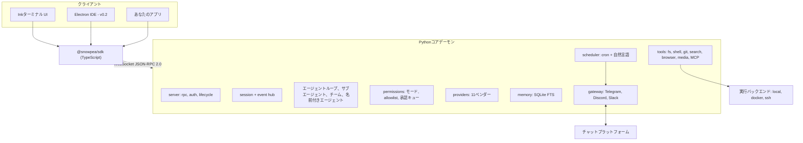

<h1 align="center">snowpea 🌱</h1>

<p align="center"><b>オープンソースのマルチベンダー・コーディングエージェント、そしてあなただけのAIアシスタント。</b></p>

<p align="center">
  <a href="README.md">English</a> ·
  <a href="README.ko.md">한국어</a> ·
  <a href="README.ja.md">日本語</a> ·
  <a href="README.zh-CN.md">简体中文</a> ·
  <a href="README.zh-TW.md">繁體中文</a> ·
  <a href="README.es.md">Español</a> ·
  <a href="README.fr.md">Français</a> ·
  <a href="README.de.md">Deutsch</a> ·
  <a href="README.pt-BR.md">Português (BR)</a> ·
  <a href="README.ru.md">Русский</a>
</p>

<p align="center">
  <a href="LICENSE"></a>
  
  
  <a href="https://github.com/Wafour-Developer/snowpea-agent/actions/workflows/ci.yml"></a>
</p>

---

snowpeaは自分のマシン上で動き、自分がお金を払っているモデルにだけ応答するコーディングエージェントです。Pythonコアがローカルデーモンとして常駐し、セッション・ツール・権限・メモリ・スケジュール・メッセンジャー連携をすべて管理します。Inkで作られたターミナルUIは、文書化されたWebSocket JSON-RPCプロトコルでそのデーモンに接続します。同じプロトコルはTypeScript SDKとしても開放されているため、あなたが作りたい他の何にでもつなげられます。11種類のLLMベンダー、ローカル・Docker・SSHでの実行、長期記憶、cronスケジューラ、Telegram/Discord/Slackゲートウェイ——これらすべてが `snowpea` というひとつのコマンドの背後にあります。ターミナルを閉じてもエージェントは動き続けるので、日中はコーディングエージェントとして、それ以外の時間はパーソナルアシスタントとして機能します。

<table>
<tr><td><b>使っているモデルをそのまま使える</b></td><td>ひとつのインターフェースの裏に11のベンダー——Anthropic、OpenAI、OpenRouter、Gemini、xAI、GLM、MiniMax、Kimi、DeepSeek、Qwen、そして自分でホストするOpenAI互換エンドポイント。セッションごとに切り替えても、コードを変更する必要はありません。</td></tr>
<tr><td><b>無理なく付き合える権限モデル</b></td><td>plan・accept（デフォルト）・autoの3モード。読み取りと編集はそのまま通り、シェル・ネットワーク・送信は確認を求められます。うんざりするほど繰り返される確認はallowlistに登録すれば、プロジェクト単位あるいはグローバルに黙って通過させられます。</td></tr>
<tr><td><b>裏口ではなく、本物のプロトコル</b></td><td>すべての機能はUIになる前にJSON-RPCメソッドとして定義されます。スキーマはひとつのPythonファイルから<a href="docs/protocol.md">docs/protocol.md</a>と<code>sdk/src/protocol.ts</code>へ生成され、両者がずれるとCIが失敗します。</td></tr>
<tr><td><b>委任し、並列に動かす</b></td><td>使い捨てのサブエージェントは設定された同時実行数の範囲内で並行して動き、チームモードでは作業者ごとにgit worktreeを与えてブランチをマージします。名前付きエージェントは自分自身のメモリとチャンネルを持ったまま、デーモンの再起動をまたいで存続します。</td></tr>
<tr><td><b>セッションをまたいで記憶する</b></td><td>SQLite FTSによる長期記憶とユーザープロフィール。関連する記憶がシステムプロンプトに注入され、回答の中でidとともに引用されます。</td></tr>
<tr><td><b>席を外していても働く</b></td><td>cronと自然言語のスケジューラがデーモン内で動き、結果をTelegram・Discord・Slackに届けます。承認依頼も同じチャットにボタン付きで届き、誰も答えなければ時間切れで拒否になります。</td></tr>
<tr><td><b>コードがある場所で実行する</b></td><td>同じツールスイートが、ローカルでも、Dockerコンテナの中でも、SSH越しの別マシンでも動作します。セッションの途中でも<code>/backend</code>で切り替えられます。</td></tr>
<tr><td><b>Claude Codeのプラグインを読める</b></td><td>Claude Code向けに書かれたプラグインをそのままインストールできます——<code>plugin.json</code>、<code>SKILL.md</code>スキル、エージェントおよびコマンドのMarkdown、フック、<code>.mcp.json</code>サーバー。3つのマーケットプレイスをひとつのコマンドから検索できます。</td></tr>
</table>

---

## クイックインストール

**macOS, Linux, WSL2**

```bash
curl -fsSL https://raw.githubusercontent.com/Wafour-Developer/snowpea-agent/main/installer/install.sh | sh
```

**Windows (PowerShell)**

```powershell
iwr https://raw.githubusercontent.com/Wafour-Developer/snowpea-agent/main/installer/install.ps1 | iex
```

インストーラーは[uv](https://docs.astral.sh/uv/)とNode 20+が入っていなければ用意し、`snowpea`コマンドをインストールして、最終的なバージョンを表示します。自分で起動するまでバックグラウンドで何かが動くことはありません。手動インストールの手順や、途中でエラーが起きた場合の対処は[docs/manual/en/install.md](docs/manual/en/install.md)を参照してください。

## クイックスタート

```bash
snowpea setup                      # ベンダーを選び、キーを貼り付けるかブラウザでログイン
snowpea                            # ターミナルUIを開く
snowpea -c "what does this repo do?"   # ヘッドレスで1ターンだけ実行して終了
```

`snowpea setup`は`$SNOWPEA_HOME/settings.json`（デフォルトは`~/.snowpea`）を書き込みます。`snowpea`はデーモンがまだ動いていなければ起動し、TUIをそこに接続します。別のターミナルでもう一度`snowpea`を実行すると、同じデーモンを再利用します。`snowpea -c`はUIを一切介さないため、スクリプトやCIで使うならこの形になります。

```bash
snowpea -c "パーサーに回帰テストを1つ追加して" --mode auto
snowpea -c "今日のdiffを要約して" --json --cwd ~/src/myproject
```

ヘッドレス実行は`--json`を付けると`session.event`レコードをJSON Linesとしてストリーム出力し、終了コードは決定的です。`0`正常終了、`1`エージェントが断念、`2`使用方法エラー、`3`デーモンなし、`4`拒否またはモードによるブロック、`5`タイムアウト。詳細は[headless.md](docs/manual/en/headless.md)にあります。

## アーキテクチャ



デーモンは起動時にループバックポートをひとつ選び、トークンとともに`$SNOWPEA_HOME/daemon.json`に記録します。同じポート上に読み取り専用のHTTPエンドポイントが3つ（`/health`、`/version`、`/protocol.json`）あり、これはヘルスチェック用です。状態を変更する呼び出しはすべてWebSocket経由のみです。[ARCHITECTURE.md](docs/ARCHITECTURE.md)がモジュール構成を示し、[docs/protocol.md](docs/protocol.md)は自動生成されたリファレンスです。

## ベンダー

v0.1には11のベンダーが搭載されています。ブラウザログインに対応するのは2つ、残りはAPIキーです。

| ベンダー | アダプター | ログイン |
|---|---|---|
| Anthropic | ネイティブMessages API | APIキー |
| OpenAI | OpenAI互換 | APIキーまたは**ブラウザログイン**（デバイスコード） |
| OpenRouter | OpenAI互換 | APIキーまたは**ブラウザログイン**（OAuth PKCE） |
| Google Gemini | ネイティブ | APIキー |
| xAI Grok | OpenAI互換 | APIキー |
| Zhipu GLM | OpenAI互換 | APIキー |
| MiniMax | OpenAI互換 | APIキー |
| Moonshot Kimi | OpenAI互換 | APIキー |
| DeepSeek | OpenAI互換 | APIキー |
| Qwen | OpenAI互換 | APIキー |
| ローカルのOpenAI互換（vLLM、Ollama、LM Studio） | OpenAI互換 | base URL、キーは任意 |

```bash
snowpea provider list                          # 利用可能なものと設定済みのものを確認
snowpea provider login openai                  # ターミナルにデバイスコードが表示され、ブラウザで承認
snowpea setup --vendor deepseek --key sk-...   # 非対話モード
```

ベンダーごとにtool-callの形式、ストリーミングのdelta、並列ツール呼び出しへの対応が異なります。その差異はすべて一箇所で正規化され、ベンダーごとのプリセットフラグとして宣言されているため、12番目のベンダーを追加するのは新しいコードパスではなく、プリセットのエントリを1件追加するだけです。詳細は[setup.md](docs/manual/en/setup.md)を参照してください。

## モードと承認

| | 読み取り | 書き込み・編集 | シェル | ネットワーク | 送信 |
|---|---|---|---|---|---|
| **plan** | 許可 | 拒否 | 拒否 | 許可 | 拒否 |
| **accept**（デフォルト） | 許可 | 許可 | 確認 | 確認 | 確認 |
| **auto** | 許可 | 許可 | 許可 | 許可 | 許可 |

UIでは`/plan`、`/accept`、`/auto`で、コマンドラインでは`--mode`で切り替えます。`/mode save`を使うと`<project>/.snowpea/settings.json`にプロジェクトのデフォルトとして保存できます。同じ確認が繰り返し出てくるようになったら、昇格させましょう。

```
/allow ^ls( .*)?$
/allow ^git (status|diff|log)\b --global
```

allowlistのエントリは*確認*を*許可*に変えるだけで、モードが拒否しているものを解禁することは決してありません。承認・拒否された内容はすべて`$SNOWPEA_HOME/logs/approvals.jsonl`に追記されます。詳しくは[modes.md](docs/manual/en/modes.md)を参照してください。

## 組み込みコマンド

```
/help        /tools       /mode        /allow       /allowlist    /backend
/plan        /accept      /auto        /approvals   /schedule
/agent       /skill       /ralph       /ultrawork   /deepinit
/deep-interview           /deep-research            /ralplan
```

- **`/ralph <task>`** は受け入れ基準付きのユーザーストーリーからなる小さなPRDを書き、それからループに入ります——サブエージェントで実装し、ストーリーが指定する検証コマンドを実行し、パスとしてマークする、これをレビュアーのサブエージェントがAPPROVEと答えるまで繰り返します。
- **`/ultrawork <task>`** はタスクを独立した部分に分割し、並行するサブエージェントに振り分け、レポートをマージします。
- **`/deepinit`** はリポジトリを巡回し、階層的な`AGENTS.md`ドキュメントを書き出します。
- **`/deep-interview`**、**`/deep-research`**、**`/ralplan`**は`SKILL.md`ファイルとして提供され、あなた自身のスキルと同じローダーで読み込まれるため、そのプロンプトを読んだり編集したりできます。
- **`/agent create "<description>"`** は`<project>/.snowpea/agents/<name>.md`にエージェント定義を生成し、すぐに`delegate_task`のターゲットとして使えるようになります。**`/skill learn`** は直前に終えたセッションを再利用可能な`SKILL.md`に変換します。
- **`/team <n> <task>`** はn人の作業者それぞれにgit worktreeを与え、タスクが完了するたびにブランチをマージします。

スラッシュコマンドはUIではなくコアに存在するため、同じ`/ralph`がTUIからでも、`snowpea -c "/ralph ..."`からでも、スケジュールされたジョブからでも、チャットのメッセージからでも同じように動きます。`snowpea commands list --json`は現在登録されているコマンド一覧をそのまま出力します。完全なリファレンスは[commands.md](docs/manual/en/commands.md)です。

## プラグインとスキル

snowpeaはClaude Codeのプラグイン構成をそのまま読み込みます。`plugin.json`、`skills/<name>/SKILL.md`、`agents/*.md`、`commands/*.md`、`hooks/hooks.json`、そして`.mcp.json`サーバーです。スキルのフロントマターは[agentskills.io](https://agentskills.io)標準に従っており、本文は`/`コマンドになります。

```bash
snowpea skill search "pdf"           # claude-marketplace、agentskills.io、hermes-hubを横断検索
snowpea skill install oh-my-claudecode
snowpea skill list
```

プロジェクトの`<project>/.snowpea/`と`<project>/.claude/`はどちらもスキャンされるため、すでにClaude Code向けに設定済みのリポジトリは変更なしでそのまま動作します。優先順位・フック・MCPサーバーについては[plugins.md](docs/manual/en/plugins.md)を参照してください。

## スケジューラとメッセンジャーゲートウェイ

```bash
snowpea job schedule --at "0 9 * * *" --task "summarize yesterday's commits" --channel telegram:123456
snowpea job list
snowpea gateway bind telegram TELEGRAM_BOT_TOKEN agent:scribe --user 987654
```

ジョブはデーモン内で、登録時に指定したモードで実行され、結果は指定したチャンネルに届けられます。スケジュール指定はcron、`in 10m`、`every 30m`、あるいは英語や韓国語による自然言語でも構いません。無人実行中に承認が必要になると、紐づけられたチャットに許可・拒否ボタンとともに届き、同時にTUIの承認キューにも表示されます。先に答えた方が採用され、`approvals.timeoutSec`（デフォルト300秒）を過ぎると拒否として自動的に期限切れになります。承認できるのは紐づけられたユーザーidのみです。詳しくは[scheduler.md](docs/manual/en/scheduler.md)と[gateway.md](docs/manual/en/gateway.md)を参照してください。

## 実行バックエンド

ツールスイートは、あなたのマシン上でも、コンテナの中でも、リモートホスト上でも同一です——ツールは常にバックエンドを経由し、ファイルシステムに直接触れることはありません。

```
/backend docker {"image": "python:3.11-slim"}
/backend ssh {"host": "10.0.0.5", "user": "build", "key": "~/.ssh/id_ed25519"}
/backend local
```

それぞれの設定は[backends.md](docs/manual/en/backends.md)にあります。

## 他ツールとの比較

| | snowpea | Claude Code | Codex CLI | opencode | Hermes |
|---|---|---|---|---|---|
| ライセンス | MIT | プロプライエタリ | オープンソース | オープンソース | MIT |
| ベンダー | 11、単一インターフェース | Anthropic | OpenAI中心 | 多数 | 多数 |
| クライアントプロトコル | 文書化されたWS JSON-RPC、TS SDK | 内部専用 | app-server JSON-RPC | HTTP + SSE | 内部専用 |
| 権限モード | plan / accept / auto + allowlist | plan / acceptEdits / bypass | 承認ポリシー | 権限設定 | コマンド承認 |
| プラグイン形式 | Claude Codeプラグイン + SKILL.md | Claude Codeプラグイン | — | TypeScriptプラグイン | agentskills.ioスキル |
| メッセンジャーゲートウェイ | Telegram, Discord, Slack | — | — | — | 6プラットフォーム |
| スケジューラ | デーモン内cron + 自然言語 | — | — | — | cron |
| 実行バックエンド | local, Docker, SSH | local | local, サンドボックス | local | 7バックエンド |
| チームモード | 共有タスクリスト + git worktree | サブエージェント | — | — | サブエージェント |

各行は本稿執筆時点のsnowpea v0.1をこれらのプロジェクトと比較したものです。他のプロジェクトは変化が速いため、各セルの内容を鵜呑みにせず、それぞれの公式ドキュメントを確認してください。

## ドキュメント

| ページ | 内容 |
|---|---|
| [インストール](docs/manual/en/install.md) | ワンライナー、手動インストール、アップグレード、アンインストール |
| [セットアップ](docs/manual/en/setup.md) | ウィザード画面、11ベンダーすべて、ブラウザログイン、検索・ブラウザプロバイダー |
| [モード](docs/manual/en/modes.md) | plan/accept/auto、権限マトリクス、allowlist、プロジェクト設定 |
| [コマンド](docs/manual/en/commands.md) | すべての組み込みコマンドとCLIサブコマンド |
| [プラグイン](docs/manual/en/plugins.md) | Claude Codeプラグイン形式、SKILL.md、フック、MCP、マーケットプレイス |
| [スケジューラ](docs/manual/en/scheduler.md) | cronおよび自然言語ジョブ、配信チャンネル |
| [ゲートウェイ](docs/manual/en/gateway.md) | Telegram、Discord、Slack、無人承認 |
| [バックエンド](docs/manual/en/backends.md) | local、Docker、SSH |
| [ヘッドレス](docs/manual/en/headless.md) | `-c`、JSON Lines、終了コード、CIでの利用 |
| [プロトコル](docs/manual/en/protocol.md) | ハンドシェイク、メソッド、イベント、バージョニング |
| [アーキテクチャ](docs/ARCHITECTURE.md) | モジュールマップ、図、プロトコル凍結ゲート |
| [コントリビューション](docs/CONTRIBUTING.md) | 開発環境構築、テスト、ベンダー・ツール・コマンドの追加方法 |

マニュアルは[韓国語](docs/manual/ko/index.md)版もあり、インストール・セットアップ・コマンドの各ページは[日本語](docs/manual/ja/install.md)、[簡体字中国語](docs/manual/zh-CN/install.md)、[スペイン語](docs/manual/es/install.md)でも用意されています。全ページ・全言語の索引は[docs/manual/README.md](docs/manual/README.md)にあります。

## ロードマップ

- **v0.1 — このリポジトリ。** コアデーモン、プロトコル、TUI、SDK、11ベンダー、ツール、メモリ、スケジューラ、ゲートウェイ、プラグイン、サブエージェントとチームモード、3プラットフォーム向けインストーラー。
- **v0.2 — デスクトップIDE。** 同じSDK上に構築されたElectronアプリで、ファイル単位のdiff承認、サブエージェントツリー、worktree並列セッション、スキルブラウザを備えます。着手はプロトコルがv1.0凍結ゲート（生成スキーマの変更がない状態でのリリースが3回連続）を通過してからです。
- **v0.3 — サイトとレジストリ。** ランディングページとマニュアルのためのsnowpea.ai、そしてアップロード・評価・キュレーションを備えたスキルレジストリを`snowpea skill search`に組み込みます。この時点でインストールURLはGitHub rawからsnowpea.aiへ移行します。

## コントリビューション

```bash
git clone https://github.com/Wafour-Developer/snowpea-agent.git
cd snowpea-agent
uv sync && npm ci
uv run pytest -q
```

最初のプルリクエストを出す前に、[docs/CONTRIBUTING.md](docs/CONTRIBUTING.md)（[한국어](docs/CONTRIBUTING.ko.md)）を読んでください。生成されたプロトコルのチェック、vendoredコードの整合性チェック、そして新しいベンダー・ツール・コマンド・検索プロバイダーをどこに組み込むかが説明されています。

## ライセンスとクレジット

snowpeaはMITライセンスです（[LICENSE](LICENSE)）。

2つのMITライセンスのプロジェクトの上に成り立っています。ツールスイートの一部と、ゲートウェイ・スケジューリング・メモリを支える実務的な仕組みは、Nous Researchの[hermes-agent](https://github.com/NousResearch/hermes-agent)からvendoringされたものです。また、いくつかの組み込みコマンドとスキルは[oh-my-claudecode](https://github.com/Yeachan-Heo/oh-my-claudecode)から移植されています。vendoredコードは`core/snowpea_core/vendor/hermes/`以下に置かれ、アップストリームのヘッダーを保持したまま、アップストリームのコミットとファイルハッシュで固定されています。私たち自身による変更はパッチとしてコミットされ、「アップストリーム + パッチ = 作業コピー」であることをCIが検証します。正本となる表は[docs/vendoring-map.md](docs/vendoring-map.md)と[docs/omc-porting-map.md](docs/omc-porting-map.md)、帰属表示は[NOTICE](NOTICE)にあります。
