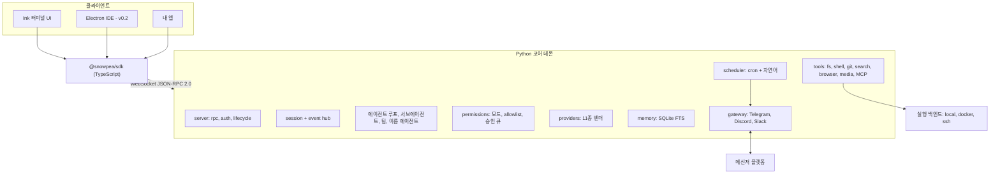

<h1 align="center">snowpea 🌱</h1>

<p align="center"><b>오픈소스 멀티벤더 코딩 에이전트, 그리고 나만의 AI 비서.</b></p>

<p align="center">
  <a href="README.md">English</a> ·
  <a href="README.ko.md">한국어</a> ·
  <a href="README.ja.md">日本語</a> ·
  <a href="README.zh-CN.md">简体中文</a> ·
  <a href="README.zh-TW.md">繁體中文</a> ·
  <a href="README.es.md">Español</a> ·
  <a href="README.fr.md">Français</a> ·
  <a href="README.de.md">Deutsch</a> ·
  <a href="README.pt-BR.md">Português (BR)</a> ·
  <a href="README.ru.md">Русский</a>
</p>

<p align="center">
  <a href="LICENSE"></a>
  
  
  <a href="https://github.com/Wafour-Developer/snowpea-agent/actions/workflows/ci.yml"></a>
</p>

---

snowpea는 내 컴퓨터에서 돌고, 내가 비용을 내는 모델에게만 답하는 코딩 에이전트입니다. Python 코어가 로컬 데몬으로 상주하면서 세션·툴·권한·메모리·스케줄·메신저 바인딩을 모두 소유하고, Ink로 만든 터미널 UI가 문서화된 WebSocket JSON-RPC 프로토콜로 그 데몬에 붙습니다. 같은 프로토콜이 TypeScript SDK로 열려 있어 원하는 앱을 그 위에 얹을 수 있습니다. 11종 LLM 벤더, 로컬·Docker·SSH 실행, 장기 메모리, cron 스케줄러, Telegram·Discord·Slack 게이트웨이가 전부 `snowpea` 하나 뒤에 있습니다. 터미널을 닫아도 에이전트는 계속 살아 있으므로, 낮에는 코딩 에이전트이고 나머지 시간에는 개인 비서입니다.

<table>
<tr><td><b>쓰던 모델을 그대로</b></td><td>한 인터페이스 뒤에 11종 벤더 — Anthropic, OpenAI, OpenRouter, Gemini, xAI, GLM, MiniMax, Kimi, DeepSeek, Qwen, 그리고 직접 띄운 OpenAI 호환 엔드포인트. 세션마다 바꿔도 코드는 그대로입니다.</td></tr>
<tr><td><b>같이 살 만한 권한 모델</b></td><td>plan·accept(기본)·auto 세 가지 모드. 읽기와 편집은 흐르고 셸·네트워크·발송은 묻습니다. 지겨워진 질문은 allowlist에 올려 프로젝트 단위 또는 전역으로 조용히 통과시킵니다.</td></tr>
<tr><td><b>뒷문이 아니라 진짜 프로토콜</b></td><td>모든 기능은 UI가 되기 전에 JSON-RPC 메서드가 됩니다. 스키마는 Python 파일 하나에서 <a href="docs/protocol.md">docs/protocol.md</a>와 <code>sdk/src/protocol.ts</code>로 생성되고, 둘이 어긋나면 CI가 막습니다.</td></tr>
<tr><td><b>위임하고 병렬로 돌립니다</b></td><td>일회성 서브에이전트가 설정한 동시성 한도 안에서 함께 돌고, 팀 모드는 작업자마다 git worktree를 주고 브랜치를 병합하며, 이름 있는 에이전트는 자기 메모리와 채널을 가진 채 데몬 재시작을 넘겨 살아남습니다.</td></tr>
<tr><td><b>세션을 넘어 기억합니다</b></td><td>SQLite FTS 장기 메모리와 사용자 프로필. 관련 기억이 시스템 프롬프트에 주입되고 답변에 id로 인용됩니다.</td></tr>
<tr><td><b>자리를 비워도 일합니다</b></td><td>cron과 자연어 스케줄러가 데몬 안에서 돌며 결과를 Telegram·Discord·Slack으로 보냅니다. 승인 요청도 같은 대화방에 버튼으로 오고, 아무도 답하지 않으면 시간이 지나 거부로 끝납니다.</td></tr>
<tr><td><b>코드가 있는 곳에서 실행</b></td><td>내 컴퓨터든, 컨테이너 안이든, SSH 너머 다른 머신이든 툴셋은 동일합니다. 툴은 항상 백엔드를 거치지 파일시스템을 직접 건드리지 않습니다. 세션 도중 <code>/backend</code>로 바꿉니다.</td></tr>
<tr><td><b>Claude Code 플러그인을 읽습니다</b></td><td>Claude Code용으로 쓰인 플러그인을 그대로 설치합니다 — <code>plugin.json</code>, <code>SKILL.md</code> 스킬, 에이전트·명령 마크다운, 훅, <code>.mcp.json</code> 서버. 마켓플레이스 세 곳을 명령 하나로 검색합니다.</td></tr>
</table>

---

## 빠른 설치

**macOS, Linux, WSL2**

```bash
curl -fsSL https://raw.githubusercontent.com/Wafour-Developer/snowpea-agent/main/installer/install.sh | sh
```

**Windows (PowerShell)**

```powershell
iwr https://raw.githubusercontent.com/Wafour-Developer/snowpea-agent/main/installer/install.ps1 | iex
```

설치 스크립트는 [uv](https://docs.astral.sh/uv/)와 Node 20+가 없으면 마련하고, `snowpea` 명령을 등록한 뒤 설치된 버전을 출력합니다. 직접 켜기 전까지 백그라운드에서 도는 것은 없습니다. 수동 설치 경로와 단계별 실패 대처는 [docs/manual/ko/install.md](docs/manual/ko/install.md)에 있습니다.

## 빠른 시작

```bash
snowpea setup                      # 벤더를 고르고 키를 넣거나 브라우저로 로그인
snowpea                            # 터미널 UI 실행
snowpea -c "이 저장소가 하는 일을 알려줘"   # 헤드리스로 한 턴만 돌고 종료
```

`snowpea setup`은 `$SNOWPEA_HOME/settings.json`(기본값 `~/.snowpea`)을 씁니다. `snowpea`는 데몬이 없으면 띄우고 TUI를 붙이며, 다른 터미널에서 한 번 더 실행하면 같은 데몬을 재사용합니다. `snowpea -c`는 UI 없이 돌기 때문에 스크립트와 CI에 그대로 넣을 수 있습니다.

```bash
snowpea -c "파서에 회귀 테스트 하나 추가해줘" --mode auto
snowpea -c "오늘 diff 요약해줘" --json --cwd ~/src/myproject
```

`--json`을 주면 `session.event`가 JSON Lines로 흘러나오고, 종료 코드는 결정적입니다. `0` 정상 완료, `1` 에이전트가 실패로 종결, `2` 사용법·설정 오류, `3` 데몬 연결 실패, `4` 승인 거부 또는 모드 차단, `5` 타임아웃. 자세한 내용은 [headless.md](docs/manual/ko/headless.md)를 보세요.

## 아키텍처



데몬은 기동 시 루프백 포트를 하나 잡고 토큰과 함께 `$SNOWPEA_HOME/daemon.json`에 기록합니다. 같은 포트에 읽기 전용 HTTP 엔드포인트 세 개(`/health`, `/version`, `/protocol.json`)가 헬스체크용으로 있고, 상태를 바꾸는 호출은 전부 WebSocket에만 있습니다. 모듈 지도는 [ARCHITECTURE.md](docs/ARCHITECTURE.md), 생성된 레퍼런스는 [docs/protocol.md](docs/protocol.md)입니다.

## 벤더

v0.1에 11종이 들어 있습니다. 브라우저 로그인은 두 곳, 나머지는 API 키입니다.

| 벤더 | 어댑터 | 로그인 |
|---|---|---|
| Anthropic | 네이티브 Messages API | API 키 |
| OpenAI | OpenAI 호환 | API 키 또는 **브라우저 로그인**(디바이스 코드) |
| OpenRouter | OpenAI 호환 | API 키 또는 **브라우저 로그인**(OAuth PKCE) |
| Google Gemini | 네이티브 | API 키 |
| xAI Grok | OpenAI 호환 | API 키 |
| Zhipu GLM | OpenAI 호환 | API 키 |
| MiniMax | OpenAI 호환 | API 키 |
| Moonshot Kimi | OpenAI 호환 | API 키 |
| DeepSeek | OpenAI 호환 | API 키 |
| Qwen | OpenAI 호환 | API 키 |
| 로컬 OpenAI 호환 (vLLM, Ollama, LM Studio) | OpenAI 호환 | base URL, 키는 선택 |

```bash
snowpea provider list                          # 어떤 벤더가 있고 무엇이 설정되었는지
snowpea provider login openai                  # 터미널에 코드가 뜨고 브라우저에서 승인
snowpea setup --vendor deepseek --key sk-...   # 비대화형
```

벤더마다 tool-call 모양, 스트리밍 delta, 병렬 툴 호출 지원이 다릅니다. 그 차이는 한 곳에서 정규화되고 벤더별 프리셋 플래그로 선언되므로, 열두 번째 벤더를 붙이는 일은 새 코드 경로가 아니라 프리셋 한 항목입니다. [setup.md](docs/manual/ko/setup.md)를 보세요.

## 모드와 승인

| | 읽기 | 쓰기·편집 | 셸 | 네트워크 | 발송 |
|---|---|---|---|---|---|
| **plan** | 허용 | 거부 | 거부 | 허용 | 거부 |
| **accept** (기본) | 허용 | 허용 | 질문 | 질문 | 질문 |
| **auto** | 허용 | 허용 | 허용 | 허용 | 허용 |

UI에서는 `/plan`, `/accept`, `/auto`로, 명령줄에서는 `--mode`로 바꾸고, `/mode save`로 `<project>/.snowpea/settings.json`에 프로젝트 기본값을 남깁니다. 같은 질문이 반복되면 승격시키세요.

```
/allow ^ls( .*)?$
/allow ^git (status|diff|log)\b --global
```

allowlist는 *질문*을 *허용*으로 올릴 뿐이고, 모드가 거부한 것을 풀어 주지는 못합니다. 승인과 거부는 전부 `$SNOWPEA_HOME/logs/approvals.jsonl`에 남습니다. 자세한 내용은 [modes.md](docs/manual/ko/modes.md)에 있습니다.

## 내장 명령

```
/help        /tools       /mode        /allow       /allowlist    /backend
/plan        /accept      /auto        /approvals   /schedule
/agent       /skill       /ralph       /ultrawork   /deepinit
/deep-interview           /deep-research            /ralplan
```

- **`/ralph <task>`** 는 수용 기준이 붙은 사용자 스토리로 작은 PRD를 쓴 뒤 반복합니다. 서브에이전트로 구현하고, 스토리가 지정한 검증 명령을 돌리고, 통과를 표시하고, 마지막에 리뷰어 서브에이전트가 APPROVE라고 답할 때까지 다시 돕니다.
- **`/ultrawork <task>`** 는 작업을 독립적인 조각으로 쪼개 서브에이전트에 동시에 던지고 보고서를 합칩니다.
- **`/deepinit`** 은 저장소를 훑어 계층적 `AGENTS.md` 문서를 씁니다.
- **`/deep-interview`**, **`/deep-research`**, **`/ralplan`** 은 `SKILL.md` 파일로 들어 있고 사용자 스킬과 같은 로더로 읽히므로, 프롬프트를 직접 읽고 고칠 수 있습니다.
- **`/agent create "<설명>"`** 은 `<project>/.snowpea/agents/<name>.md`에 에이전트 정의를 만들고 바로 `delegate_task` 대상이 되게 합니다. **`/skill learn`** 은 방금 끝낸 세션을 재사용 가능한 `SKILL.md`로 바꿉니다.
- **`/team <n> <task>`** 는 작업자 n명에게 각각 git worktree를 주고 태스크가 끝나는 대로 브랜치를 병합합니다.

슬래시 명령은 UI가 아니라 코어에 있습니다. 그래서 같은 `/ralph`가 TUI에서도, `snowpea -c "/ralph ..."`에서도, 예약 잡에서도, 메신저 메시지에서도 똑같이 돕니다. `snowpea commands list --json`이 현재 등록된 명령을 그대로 출력합니다. 전체 레퍼런스는 [commands.md](docs/manual/ko/commands.md)입니다.

## 플러그인과 스킬

snowpea는 Claude Code 플러그인 배치를 그대로 읽습니다. `plugin.json`, `skills/<name>/SKILL.md`, `agents/*.md`, `commands/*.md`, `hooks/hooks.json`, `.mcp.json` 서버까지입니다. 스킬의 front matter는 [agentskills.io](https://agentskills.io) 표준을 따르고, 본문은 `/` 명령이 됩니다.

```bash
snowpea skill search "pdf"           # claude-marketplace, agentskills.io, hermes-hub를 함께 검색
snowpea skill install oh-my-claudecode
snowpea skill list
```

프로젝트의 `<project>/.snowpea/`와 `<project>/.claude/`를 모두 훑기 때문에, 이미 Claude Code용으로 준비된 저장소는 손대지 않아도 그대로 동작합니다. 우선순위·훅·MCP 서버는 [plugins.md](docs/manual/ko/plugins.md)에 있습니다.

## 스케줄러와 메신저 게이트웨이

```bash
snowpea job schedule --at "0 9 * * *" --task "어제 커밋 요약" --channel telegram:123456
snowpea job list
snowpea gateway bind telegram TELEGRAM_BOT_TOKEN agent:scribe --user 987654
```

잡은 데몬 안에서, 등록할 때 지정한 모드로 돌고, 결과를 지정한 채널로 보냅니다. 스펙은 cron, `in 10m`, `every 30m`, 또는 한국어·영어 자연어("매일 09:00")입니다. 무인 실행 중 승인이 필요해지면 바인딩된 대화방에 허용·거부 버튼과 함께 도착하고, 동시에 TUI 승인 큐에도 뜹니다. 먼저 온 응답이 이기고, `approvals.timeoutSec`(기본 300초)이 지나면 자동 거부됩니다. 승인은 바인딩된 사용자 id만 할 수 있습니다. [scheduler.md](docs/manual/ko/scheduler.md)와 [gateway.md](docs/manual/ko/gateway.md)를 보세요.

## 실행 백엔드

툴셋은 내 머신이든 컨테이너든 원격 호스트든 동일합니다.

```
/backend docker {"image": "python:3.11-slim"}
/backend ssh {"host": "10.0.0.5", "user": "build", "key": "~/.ssh/id_ed25519"}
/backend local
```

각각의 설정은 [backends.md](docs/manual/ko/backends.md)에 있습니다.

## 다른 도구와 비교

| | snowpea | Claude Code | Codex CLI | opencode | Hermes |
|---|---|---|---|---|---|
| 라이선스 | MIT | 독점 | 오픈소스 | 오픈소스 | MIT |
| 벤더 | 11종, 단일 인터페이스 | Anthropic | OpenAI 중심 | 다수 | 다수 |
| 클라이언트 프로토콜 | 문서화된 WS JSON-RPC + TS SDK | 내부 | app-server JSON-RPC | HTTP + SSE | 내부 |
| 권한 모드 | plan/accept/auto + allowlist | plan/acceptEdits/bypass | 승인 정책 | 권한 설정 | 명령 승인 |
| 플러그인 포맷 | Claude Code 플러그인 + SKILL.md | Claude Code 플러그인 | — | TypeScript 플러그인 | agentskills.io 스킬 |
| 메신저 게이트웨이 | Telegram, Discord, Slack | — | — | — | 6개 플랫폼 |
| 스케줄러 | 데몬 내 cron + 자연어 | — | — | — | cron |
| 실행 백엔드 | local, Docker, SSH | local | local, 샌드박스 | local | 7종 |
| 팀 모드 | 공유 태스크 리스트 + git worktree | 서브에이전트 | — | — | 서브에이전트 |

작성 시점의 snowpea v0.1 기준 비교입니다. 다른 프로젝트들은 빠르게 바뀌므로 각 칸에 기대기 전에 해당 문서를 확인하세요.

## 문서

| 문서 | 내용 |
|---|---|
| [설치](docs/manual/ko/install.md) | 한 줄 설치, 수동 설치, 업그레이드, 제거 |
| [설정](docs/manual/ko/setup.md) | 마법사 화면, 11종 벤더, 브라우저 로그인, 검색·브라우저 제공자 |
| [모드](docs/manual/ko/modes.md) | plan/accept/auto, 권한 매트릭스, allowlist, 프로젝트 설정 |
| [명령](docs/manual/ko/commands.md) | 모든 내장 명령과 CLI 서브커맨드 |
| [플러그인](docs/manual/ko/plugins.md) | Claude Code 플러그인 포맷, SKILL.md, 훅, MCP, 마켓플레이스 |
| [스케줄러](docs/manual/ko/scheduler.md) | cron·자연어 잡, 전달 채널 |
| [게이트웨이](docs/manual/ko/gateway.md) | Telegram, Discord, Slack, 무인 승인 |
| [백엔드](docs/manual/ko/backends.md) | local, Docker, SSH |
| [헤드리스](docs/manual/ko/headless.md) | `-c`, JSON Lines, 종료 코드, CI 사용 |
| [프로토콜](docs/manual/ko/protocol.md) | 핸드셰이크, 메서드, 이벤트, 버전 정책 |
| [아키텍처](docs/ARCHITECTURE.md) | 모듈 지도, 다이어그램, 프로토콜 동결 게이트 |
| [기여](docs/CONTRIBUTING.ko.md) | 개발 환경, 테스트, 벤더·툴·명령 추가 방법 |

영어 매뉴얼은 [여기](docs/manual/en/index.md)에 있고, 설치·설정·명령 페이지는 [일본어](docs/manual/ja/install.md)·[중국어 간체](docs/manual/zh-CN/install.md)·[스페인어](docs/manual/es/install.md)로도 있습니다. 전체 목록은 [docs/manual/README.md](docs/manual/README.md)입니다.

## 로드맵

- **v0.1 — 이 저장소.** 코어 데몬, 프로토콜, TUI, SDK, 11종 벤더, 툴셋, 메모리, 스케줄러, 게이트웨이, 플러그인, 서브에이전트와 팀 모드, 3개 OS 설치 스크립트.
- **v0.2 — 데스크톱 IDE.** 같은 SDK 위에 얹는 Electron 앱. 파일별 diff 승인, 서브에이전트 트리, worktree 병렬 세션, 스킬 브라우저. 프로토콜이 v1.0 동결 게이트(연속 세 릴리즈 동안 생성 스키마 변경 0)를 통과한 뒤에 착수합니다.
- **v0.3 — 사이트와 레지스트리.** snowpea.ai에 랜딩과 매뉴얼을 올리고, 업로드·별점·큐레이션이 있는 스킬 레지스트리를 `snowpea skill search`에 연결합니다. 이 시점에 설치 URL이 GitHub raw에서 snowpea.ai로 옮겨 갑니다.

## 기여하기

```bash
git clone https://github.com/Wafour-Developer/snowpea-agent.git
cd snowpea-agent
uv sync && npm ci
uv run pytest -q
```

첫 PR 전에 [docs/CONTRIBUTING.ko.md](docs/CONTRIBUTING.ko.md)([English](docs/CONTRIBUTING.md))를 읽어 주세요. 생성된 프로토콜 검사, vendored 코드 무결성 검사, 그리고 새 벤더·툴·명령·검색 제공자를 어디에 끼우는지가 들어 있습니다.

## 라이선스와 크레딧

snowpea는 MIT 라이선스입니다([LICENSE](LICENSE)).

두 개의 MIT 프로젝트 위에 서 있습니다. 툴셋의 일부와 게이트웨이·스케줄·메모리의 실무 장치들은 Nous Research의 [hermes-agent](https://github.com/NousResearch/hermes-agent)에서 vendoring했고, 내장 명령과 스킬 몇 가지는 [oh-my-claudecode](https://github.com/Yeachan-Heo/oh-my-claudecode)에서 이식했습니다. vendored 코드는 `core/snowpea_core/vendor/hermes/` 아래에 원본 헤더를 유지한 채 원본 커밋과 파일 해시로 고정되어 있으며, 우리가 가한 수정은 패치로 커밋되고 "원본 + 패치 == 작업본"을 CI가 검증합니다. 정본 표는 [docs/vendoring-map.md](docs/vendoring-map.md)와 [docs/omc-porting-map.md](docs/omc-porting-map.md)이고, 고지는 [NOTICE](NOTICE)에 있습니다.
