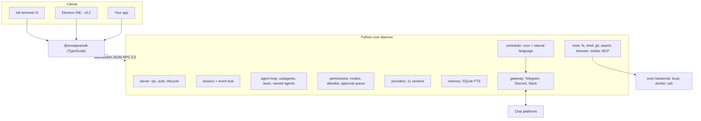

<h1 align="center">snowpea 🌱</h1>

<p align="center"><b>An open-source, multi-vendor coding agent — and your own AI assistant.</b></p>

<p align="center">
  <a href="README.md">English</a> ·
  <a href="README.ko.md">한국어</a> ·
  <a href="README.ja.md">日本語</a> ·
  <a href="README.zh-CN.md">简体中文</a> ·
  <a href="README.zh-TW.md">繁體中文</a> ·
  <a href="README.es.md">Español</a> ·
  <a href="README.fr.md">Français</a> ·
  <a href="README.de.md">Deutsch</a> ·
  <a href="README.pt-BR.md">Português (BR)</a> ·
  <a href="README.ru.md">Русский</a>
</p>

<p align="center">
  <a href="LICENSE"></a>
  
  
  <a href="https://github.com/Wafour-Developer/snowpea-agent/actions/workflows/ci.yml"></a>
</p>

---

snowpea is a coding agent that runs on your own machine and answers to whichever model you pay for. A Python core runs as a local daemon that owns sessions, tools, permissions, memory, schedules and messenger bindings; an Ink terminal UI attaches to it over a documented WebSocket JSON-RPC protocol; and a TypeScript SDK opens that same protocol to anything else you want to build. Eleven LLM vendors, local/Docker/SSH execution, long-term memory, a cron scheduler and Telegram/Discord/Slack gateways sit behind one command: `snowpea`. Because the agent keeps running after you close the terminal, it is a coding agent during the day and a personal assistant the rest of the time.

<table>
<tr><td><b>Bring your own model</b></td><td>Eleven vendors behind one interface — Anthropic, OpenAI, OpenRouter, Gemini, xAI, GLM, MiniMax, Kimi, DeepSeek, Qwen, and any OpenAI-compatible endpoint you host yourself. Switch per session, no code changes.</td></tr>
<tr><td><b>A permission model you can live with</b></td><td>Three modes — plan, accept (the default), auto. Reads and edits flow; shell, network and send actions ask. An allowlist turns the prompts you are tired of into silent approvals, per project or globally.</td></tr>
<tr><td><b>A real protocol, not a private back door</b></td><td>Every capability is a JSON-RPC method before it is a UI. The schema is generated from one Python file into <a href="docs/protocol.md">docs/protocol.md</a> and <code>sdk/src/protocol.ts</code>, and CI fails if they drift.</td></tr>
<tr><td><b>Delegates and parallelizes</b></td><td>One-shot subagents run concurrently under a configurable limit, team mode gives each worker its own git worktree and merges their branches, and named agents persist across daemon restarts with their own memory and channels.</td></tr>
<tr><td><b>Remembers across sessions</b></td><td>SQLite FTS long-term memory plus a user profile. Relevant memories are injected into the system prompt and cited by id in the answer.</td></tr>
<tr><td><b>Works while you are away</b></td><td>A cron and natural-language scheduler runs inside the daemon and delivers results to Telegram, Discord or Slack. Approvals come to the same chat as buttons, and expire into a denial if nobody answers.</td></tr>
<tr><td><b>Runs where the code is</b></td><td>The same tool suite executes locally, inside a Docker container, or over SSH on another machine. Switch mid-session with <code>/backend</code>.</td></tr>
<tr><td><b>Speaks Claude Code plugin</b></td><td>Install plugins written for Claude Code — <code>plugin.json</code>, <code>SKILL.md</code> skills, agent and command markdown, hooks, <code>.mcp.json</code> servers — and search three marketplaces from one command.</td></tr>
</table>

---

## Quick install

**macOS, Linux, WSL2**

```bash
curl -fsSL https://raw.githubusercontent.com/Wafour-Developer/snowpea-agent/main/installer/install.sh | sh
```

**Windows (PowerShell)**

```powershell
iwr https://raw.githubusercontent.com/Wafour-Developer/snowpea-agent/main/installer/install.ps1 | iex
```

The installer puts [uv](https://docs.astral.sh/uv/) and Node 20+ in place if they are missing, installs the `snowpea` command, and prints the version it ended up with. Nothing runs in the background until you start it. See [docs/manual/en/install.md](docs/manual/en/install.md) for the manual path and for what to do when a step fails.

## Quick start

```bash
snowpea setup                      # pick a vendor, paste a key or log in through the browser
snowpea                            # open the terminal UI
snowpea -c "what does this repo do?"   # one headless turn, then exit
```

`snowpea setup` writes `$SNOWPEA_HOME/settings.json` (`~/.snowpea` by default). `snowpea` starts the daemon if it is not already running and attaches the TUI to it; a second `snowpea` in another terminal reuses the same daemon. `snowpea -c` skips the UI entirely and is the shape you want in scripts and CI:

```bash
snowpea -c "add a regression test for the parser" --mode auto
snowpea -c "summarize today's diff" --json --cwd ~/src/myproject
```

Headless runs stream `session.event` records as JSON Lines under `--json` and end with a deterministic exit code: `0` done, `1` the agent gave up, `2` usage error, `3` no daemon, `4` denied or blocked by the mode, `5` timed out. Details in [headless.md](docs/manual/en/headless.md).

## Architecture



The daemon binds a loopback port chosen at start-up and records it, with a token, in `$SNOWPEA_HOME/daemon.json`. Three read-only HTTP endpoints (`/health`, `/version`, `/protocol.json`) sit on the same port for probes; every state-changing call is WebSocket-only. [ARCHITECTURE.md](docs/ARCHITECTURE.md) maps the modules, and [docs/protocol.md](docs/protocol.md) is the generated reference.

## Vendors

Eleven vendors ship in v0.1. OpenAI and OpenRouter support browser login; Gemini
also supports Google OAuth through Application Default Credentials. The remaining
providers use vendor API keys.

| Vendor | Adapter | Login |
|---|---|---|
| Anthropic | native Messages API | API key |
| OpenAI | OpenAI-compatible | API key, **browser login** (device code), or access token |
| OpenRouter | OpenAI-compatible | API key or **browser login** (OAuth PKCE) |
| Google Gemini | native | API key or **Google OAuth login** (`gcloud` ADC / remote access token) |
| xAI Grok | OpenAI-compatible | API key |
| Zhipu GLM | OpenAI-compatible | API key |
| MiniMax | OpenAI-compatible | API key |
| Moonshot Kimi | OpenAI-compatible | API key |
| DeepSeek | OpenAI-compatible | API key |
| Qwen | OpenAI-compatible | API key |
| Local OpenAI-compatible (vLLM, Ollama, LM Studio) | OpenAI-compatible | base URL, key optional |

```bash
snowpea provider list                          # what is available and what is configured
snowpea provider login openai                  # device code in the terminal, approve in the browser
snowpea setup --vendor deepseek --key sk-...   # non-interactive
```

Vendors differ in tool-call shape, streaming deltas and parallel tool support. All of it is normalized in one place and declared per vendor as preset flags, so adding a twelfth vendor is a preset entry, not a new code path. See [setup.md](docs/manual/en/setup.md).

## Modes and approvals

| | read | write / edit | shell | network | send |
|---|---|---|---|---|---|
| **plan** | allow | deny | deny | allow | deny |
| **accept** (default) | allow | allow | ask | ask | ask |
| **auto** | allow | allow | allow | allow | allow |

Switch with `/plan`, `/accept`, `/auto` in the UI, with `--mode` on the command line, or persist a project default with `/mode save` into `<project>/.snowpea/settings.json`. When a prompt gets repetitive, promote it:

```
/allow ^ls( .*)?$
/allow ^git (status|diff|log)\b --global
```

An allowlist entry only ever turns *ask* into *allow*; it can never unblock something the mode denies. Everything approved or denied is appended to `$SNOWPEA_HOME/logs/approvals.jsonl`. More in [modes.md](docs/manual/en/modes.md).

## Built-in commands

```
/help        /tools       /mode        /allow       /allowlist    /backend
/plan        /accept      /auto        /approvals   /schedule
/agent       /skill       /ralph       /ultrawork   /deepinit
/deep-interview           /deep-research            /ralplan
```

- **`/ralph <task>`** writes a small PRD of user stories with acceptance criteria, then loops — implement with subagents, run the verification commands the story names, mark it passing — until a reviewer subagent answers APPROVE.
- **`/ultrawork <task>`** splits a task into independent parts, fans them out to concurrent subagents, and merges the reports.
- **`/deepinit`** walks the repository and writes hierarchical `AGENTS.md` documentation.
- **`/deep-interview`**, **`/deep-research`** and **`/ralplan`** ship as `SKILL.md` files loaded through the same loader your own skills use, so you can read and edit their prompts.
- **`/agent create "<description>"`** generates an agent definition into `<project>/.snowpea/agents/<name>.md`, immediately usable as a `delegate_task` target. **`/skill learn`** turns the session you just finished into a reusable `SKILL.md`.
- **`/team <n> <task>`** gives each of n workers a git worktree and merges their branches as tasks finish.

Slash commands live in the core, not the UI, so the same `/ralph` runs from the TUI, from `snowpea -c "/ralph ..."`, from a scheduled job and from a chat message. `snowpea commands list --json` prints the live registry. Full reference: [commands.md](docs/manual/en/commands.md).

## Plugins and skills

snowpea reads the Claude Code plugin layout as-is: `plugin.json`, `skills/<name>/SKILL.md`, `agents/*.md`, `commands/*.md`, `hooks/hooks.json`, and `.mcp.json` servers. A skill's front matter follows the [agentskills.io](https://agentskills.io) standard, and its body becomes a `/`-command.

```bash
snowpea skill search "pdf"           # searches claude-marketplace, agentskills.io and hermes-hub
snowpea skill install oh-my-claudecode
snowpea skill list
```

Project-local `<project>/.snowpea/` and `<project>/.claude/` directories are both scanned, so a repository that is already set up for Claude Code works without changes. [plugins.md](docs/manual/en/plugins.md) covers precedence, hooks and MCP servers.

## Scheduler and messenger gateway

```bash
snowpea job schedule --at "0 9 * * *" --task "summarize yesterday's commits" --channel telegram:123456
snowpea job list
snowpea gateway bind telegram TELEGRAM_BOT_TOKEN agent:scribe --user 987654
```

Jobs run inside the daemon, in the mode you registered them with, and deliver the answer to the channel you named. Specs can be cron, `in 10m`, `every 30m`, or natural language in English or Korean. When an unattended run needs an approval it arrives in the bound chat with allow/deny buttons, appears simultaneously in the TUI approval queue, accepts whichever answer comes first, and expires into a denial after `approvals.timeoutSec` (300 by default). Only the bound user id may approve. See [scheduler.md](docs/manual/en/scheduler.md) and [gateway.md](docs/manual/en/gateway.md).

## Execution backends

The tool suite is identical whether it runs on your machine, in a container, or on a remote host — tools always go through the backend, never straight to the filesystem.

```
/backend docker {"image": "python:3.11-slim"}
/backend ssh {"host": "10.0.0.5", "user": "build", "key": "~/.ssh/id_ed25519"}
/backend local
```

[backends.md](docs/manual/en/backends.md) has the configuration for each.

## How it compares

| | snowpea | Claude Code | Codex CLI | opencode | Hermes |
|---|---|---|---|---|---|
| License | MIT | proprietary | open source | open source | MIT |
| Vendors | 11, one interface | Anthropic | OpenAI-centric | many | many |
| Client protocol | WS JSON-RPC, documented, TS SDK | internal | app-server JSON-RPC | HTTP + SSE | internal |
| Permission modes | plan / accept / auto + allowlist | plan / acceptEdits / bypass | approval policies | permissions config | command approval |
| Plugin format | Claude Code plugins + SKILL.md | Claude Code plugins | — | TypeScript plugins | agentskills.io skills |
| Messenger gateway | Telegram, Discord, Slack | — | — | — | six platforms |
| Scheduler | cron + natural language, in-daemon | — | — | — | cron |
| Execution backends | local, Docker, SSH | local | local, sandbox | local | seven backends |
| Team mode | shared task list + git worktrees | subagents | — | — | subagents |

Rows describe snowpea v0.1 against these projects as of writing; the other projects move fast, so check their own documentation before relying on a cell.

## Documentation

| Page | What is in it |
|---|---|
| [Install](docs/manual/en/install.md) | one-liner, manual install, upgrading, uninstalling |
| [Setup](docs/manual/en/setup.md) | wizard screens, all eleven vendors, browser login, search and browser providers |
| [Modes](docs/manual/en/modes.md) | plan/accept/auto, the permission matrix, allowlist, project settings |
| [Commands](docs/manual/en/commands.md) | every built-in command and CLI subcommand |
| [Plugins](docs/manual/en/plugins.md) | Claude Code plugin format, SKILL.md, hooks, MCP, marketplaces |
| [Scheduler](docs/manual/en/scheduler.md) | cron and natural-language jobs, delivery channels |
| [Gateway](docs/manual/en/gateway.md) | Telegram, Discord, Slack, unattended approvals |
| [Backends](docs/manual/en/backends.md) | local, Docker, SSH |
| [Headless](docs/manual/en/headless.md) | `-c`, JSON Lines, exit codes, CI usage |
| [Protocol](docs/manual/en/protocol.md) | handshake, methods, events, versioning |
| [Architecture](docs/ARCHITECTURE.md) | module map, diagrams, protocol freeze gate |
| [Contributing](docs/CONTRIBUTING.md) | dev setup, tests, adding a vendor, tool or command |

The manual is also available in [Korean](docs/manual/ko/index.md), and its install/setup/commands pages in [Japanese](docs/manual/ja/install.md), [Simplified Chinese](docs/manual/zh-CN/install.md) and [Spanish](docs/manual/es/install.md). Index of every page and language: [docs/manual/README.md](docs/manual/README.md).

## Roadmap

- **v0.1 — this repository.** Core daemon, protocol, TUI, SDK, eleven vendors, tools, memory, scheduler, gateway, plugins, subagents and team mode, installers for three platforms.
- **v0.2 — desktop IDE.** An Electron app on the same SDK, with per-file diff approval, a subagent tree, worktree-parallel sessions and a skill browser. It starts only after the protocol passes its v1.0 freeze gate: three consecutive releases with no change to the generated schema.
- **v0.3 — site and registry.** snowpea.ai for the landing page and manual, plus a skill registry with upload, ratings and curation wired into `snowpea skill search`. The install URL moves from GitHub raw to snowpea.ai at that point.

## Contributing

```bash
git clone https://github.com/Wafour-Developer/snowpea-agent.git
cd snowpea-agent
uv sync && npm ci
uv run pytest -q
```

Read [docs/CONTRIBUTING.md](docs/CONTRIBUTING.md) ([한국어](docs/CONTRIBUTING.ko.md)) before your first pull request — it covers the generated-protocol check, the vendored-code integrity check, and where new vendors, tools, commands and search providers plug in.

## Known limitations (v0.1)

- **MCP over SSE** is parsed but not implemented; stdio MCP servers work. (`tools/mcp_client.py`)
- **OpenAI device-code login** uses a placeholder client id because OpenAI publishes no public device-code client for API keys; use an API key. OpenRouter OAuth PKCE works.
- **Marketplace search endpoints** for agentskills.io and hermes-hub are documented guesses; Claude Code marketplaces (`marketplace.json` repos) work.
- **Messenger delivery, scheduled delivery and approval timeouts** are verified with a fake adapter; live Telegram/Discord/Slack runs need your own credentials (`tests/e2e/v01_smoke.sh` steps 10–11).
- Protocol is `0.1.0`; the v1.0 freeze gate applies before the v0.2 IDE.

## License and credits

snowpea is MIT licensed ([LICENSE](LICENSE)).

It stands on two MIT-licensed projects. Parts of the tool suite and the practical machinery behind gateways, scheduling and memory are vendored from [hermes-agent](https://github.com/NousResearch/hermes-agent) by Nous Research; several built-in commands and skills are ported from [oh-my-claudecode](https://github.com/Yeachan-Heo/oh-my-claudecode). Vendored code lives under `core/snowpea_core/vendor/hermes/`, keeps its upstream header, and is pinned by upstream commit and file hash — our own modifications are committed as patches and CI verifies that upstream plus patch equals the working copy. The authoritative tables are [docs/vendoring-map.md](docs/vendoring-map.md) and [docs/omc-porting-map.md](docs/omc-porting-map.md); attribution is in [NOTICE](NOTICE).
