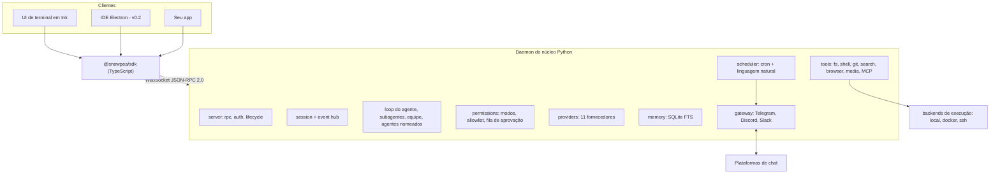

<h1 align="center">snowpea 🌱</h1>

<p align="center"><b>Um agente de codificação open-source e multi-fornecedor — e o seu próprio assistente de IA.</b></p>

<p align="center">
  <a href="README.md">English</a> ·
  <a href="README.ko.md">한국어</a> ·
  <a href="README.ja.md">日本語</a> ·
  <a href="README.zh-CN.md">简体中文</a> ·
  <a href="README.zh-TW.md">繁體中文</a> ·
  <a href="README.es.md">Español</a> ·
  <a href="README.fr.md">Français</a> ·
  <a href="README.de.md">Deutsch</a> ·
  <a href="README.pt-BR.md">Português (BR)</a> ·
  <a href="README.ru.md">Русский</a>
</p>

<p align="center">
  <a href="LICENSE"></a>
  
  
  <a href="https://github.com/Wafour-Developer/snowpea-agent/actions/workflows/ci.yml"></a>
</p>

---

snowpea é um agente de codificação que roda na sua própria máquina e responde apenas ao modelo pelo qual você paga. Um núcleo em Python roda como um daemon local que é dono das sessões, ferramentas, permissões, memória, agendamentos e integrações com mensageiros; uma UI de terminal em Ink se conecta a ele por um protocolo WebSocket JSON-RPC documentado; e um SDK em TypeScript abre esse mesmo protocolo para qualquer outra coisa que você queira construir. Onze fornecedores de LLM, execução local/Docker/SSH, memória de longo prazo, um agendador cron e gateways de Telegram/Discord/Slack ficam todos atrás de um único comando: `snowpea`. Como o agente continua rodando depois que você fecha o terminal, ele é um agente de codificação durante o dia e um assistente pessoal no resto do tempo.

<table>
<tr><td><b>Use o modelo que você já tem</b></td><td>Onze fornecedores atrás de uma única interface — Anthropic, OpenAI, OpenRouter, Gemini, xAI, GLM, MiniMax, Kimi, DeepSeek, Qwen, e qualquer endpoint compatível com OpenAI que você mesmo hospede. Troque por sessão, sem mudar código.</td></tr>
<tr><td><b>Um modelo de permissão com o qual dá para conviver</b></td><td>Três modos — plan, accept (o padrão), auto. Leituras e edições fluem; ações de shell, rede e envio perguntam. Uma allowlist transforma os prompts que já te cansaram em aprovações silenciosas, por projeto ou globalmente.</td></tr>
<tr><td><b>Um protocolo de verdade, não uma porta dos fundos</b></td><td>Toda funcionalidade é um método JSON-RPC antes de ser uma UI. O schema é gerado a partir de um único arquivo Python para <a href="docs/protocol.md">docs/protocol.md</a> e <code>sdk/src/protocol.ts</code>, e o CI falha se eles divergirem.</td></tr>
<tr><td><b>Delega e paraleliza</b></td><td>Subagentes de execução única rodam concorrentemente sob um limite configurável, o modo equipe dá a cada trabalhador seu próprio git worktree e faz o merge das branches, e agentes nomeados persistem entre reinícios do daemon com sua própria memória e canais.</td></tr>
<tr><td><b>Lembra entre sessões</b></td><td>Memória de longo prazo com SQLite FTS mais um perfil de usuário. Memórias relevantes são injetadas no prompt de sistema e citadas por id na resposta.</td></tr>
<tr><td><b>Trabalha enquanto você está fora</b></td><td>Um agendador de cron e linguagem natural roda dentro do daemon e entrega resultados no Telegram, Discord ou Slack. As aprovações chegam no mesmo chat como botões, e expiram em uma negação se ninguém responder.</td></tr>
<tr><td><b>Roda onde o código está</b></td><td>O mesmo conjunto de ferramentas executa localmente, dentro de um container Docker, ou via SSH em outra máquina. Troque no meio da sessão com <code>/backend</code>.</td></tr>
<tr><td><b>Fala plugin do Claude Code</b></td><td>Instale plugins escritos para o Claude Code — <code>plugin.json</code>, skills <code>SKILL.md</code>, markdown de agentes e comandos, hooks, servidores <code>.mcp.json</code> — e pesquise três marketplaces com um único comando.</td></tr>
</table>

---

## Instalação rápida

**macOS, Linux, WSL2**

```bash
curl -fsSL https://raw.githubusercontent.com/Wafour-Developer/snowpea-agent/main/installer/install.sh | sh
```

**Windows (PowerShell)**

```powershell
iwr https://raw.githubusercontent.com/Wafour-Developer/snowpea-agent/main/installer/install.ps1 | iex
```

O instalador coloca o [uv](https://docs.astral.sh/uv/) e o Node 20+ no lugar caso estejam faltando, instala o comando `snowpea`, e imprime a versão com a qual terminou. Nada roda em segundo plano até que você o inicie. Veja [docs/manual/en/install.md](docs/manual/en/install.md) para o caminho manual e para o que fazer quando uma etapa falha.

## Início rápido

```bash
snowpea setup                      # escolha um fornecedor, cole uma chave ou faça login pelo navegador
snowpea                            # abre a UI de terminal
snowpea -c "o que este repositório faz?"   # um turno headless, depois sai
```

`snowpea setup` grava `$SNOWPEA_HOME/settings.json` (`~/.snowpea` por padrão). `snowpea` inicia o daemon se ele ainda não estiver rodando e conecta a TUI a ele; um segundo `snowpea` em outro terminal reaproveita o mesmo daemon. `snowpea -c` pula a UI completamente e é o formato que você quer em scripts e CI:

```bash
snowpea -c "adicione um teste de regressão para o parser" --mode auto
snowpea -c "resuma o diff de hoje" --json --cwd ~/src/myproject
```

Execuções headless transmitem registros `session.event` como JSON Lines sob `--json` e terminam com um código de saída determinístico: `0` concluído, `1` o agente desistiu, `2` erro de uso, `3` sem daemon, `4` negado ou bloqueado pelo modo, `5` tempo esgotado. Detalhes em [headless.md](docs/manual/en/headless.md).

## Arquitetura



O daemon vincula uma porta loopback escolhida na inicialização e a registra, junto com um token, em `$SNOWPEA_HOME/daemon.json`. Três endpoints HTTP somente leitura (`/health`, `/version`, `/protocol.json`) ficam na mesma porta para sondagens; toda chamada que altera estado é exclusiva do WebSocket. [ARCHITECTURE.md](docs/ARCHITECTURE.md) mapeia os módulos, e [docs/protocol.md](docs/protocol.md) é a referência gerada.

## Fornecedores

Onze fornecedores são entregues na v0.1. Dois suportam login pelo navegador; o restante usa uma chave de API.

| Fornecedor | Adaptador | Login |
|---|---|---|
| Anthropic | Messages API nativa | Chave de API |
| OpenAI | Compatível com OpenAI | Chave de API ou **login pelo navegador** (código de dispositivo) |
| OpenRouter | Compatível com OpenAI | Chave de API ou **login pelo navegador** (OAuth PKCE) |
| Google Gemini | Nativa | Chave de API |
| xAI Grok | Compatível com OpenAI | Chave de API |
| Zhipu GLM | Compatível com OpenAI | Chave de API |
| MiniMax | Compatível com OpenAI | Chave de API |
| Moonshot Kimi | Compatível com OpenAI | Chave de API |
| DeepSeek | Compatível com OpenAI | Chave de API |
| Qwen | Compatível com OpenAI | Chave de API |
| OpenAI-compatível local (vLLM, Ollama, LM Studio) | Compatível com OpenAI | URL base, chave opcional |

```bash
snowpea provider list                          # o que está disponível e o que está configurado
snowpea provider login openai                  # código de dispositivo no terminal, aprove no navegador
snowpea setup --vendor deepseek --key sk-...   # não interativo
```

Os fornecedores diferem na forma das chamadas de ferramenta, nos deltas de streaming e no suporte a chamadas paralelas de ferramentas. Tudo isso é normalizado em um único lugar e declarado por fornecedor como flags de preset, então adicionar um décimo segundo fornecedor é uma entrada de preset, não um novo caminho de código. Veja [setup.md](docs/manual/en/setup.md).

## Modos e aprovações

| | leitura | escrita / edição | shell | rede | envio |
|---|---|---|---|---|---|
| **plan** | permite | nega | nega | permite | nega |
| **accept** (padrão) | permite | permite | pergunta | pergunta | pergunta |
| **auto** | permite | permite | permite | permite | permite |

Troque com `/plan`, `/accept`, `/auto` na UI, com `--mode` na linha de comando, ou persista um padrão de projeto com `/mode save` em `<project>/.snowpea/settings.json`. Quando um prompt fica repetitivo, promova-o:

```
/allow ^ls( .*)?$
/allow ^git (status|diff|log)\b --global
```

Uma entrada de allowlist só transforma *pergunta* em *permite*; ela nunca pode desbloquear algo que o modo nega. Tudo que é aprovado ou negado é anexado a `$SNOWPEA_HOME/logs/approvals.jsonl`. Mais em [modes.md](docs/manual/en/modes.md).

## Comandos integrados

```
/help        /tools       /mode        /allow       /allowlist    /backend
/plan        /accept      /auto        /approvals   /schedule
/agent       /skill       /ralph       /ultrawork   /deepinit
/deep-interview           /deep-research            /ralplan
```

- **`/ralph <task>`** escreve um pequeno PRD de histórias de usuário com critérios de aceitação, e então entra em loop — implementa com subagentes, roda os comandos de verificação que a história indica, marca como aprovada — até que um subagente revisor responda APPROVE.
- **`/ultrawork <task>`** divide uma tarefa em partes independentes, as distribui para subagentes concorrentes, e faz o merge dos relatórios.
- **`/deepinit`** percorre o repositório e escreve documentação hierárquica em `AGENTS.md`.
- **`/deep-interview`**, **`/deep-research`** e **`/ralplan`** são entregues como arquivos `SKILL.md` carregados pelo mesmo loader que suas próprias skills usam, então você pode ler e editar os prompts deles.
- **`/agent create "<description>"`** gera uma definição de agente em `<project>/.snowpea/agents/<name>.md`, imediatamente utilizável como alvo de `delegate_task`. **`/skill learn`** transforma a sessão que você acabou de terminar em um `SKILL.md` reutilizável.
- **`/team <n> <task>`** dá a cada um dos n trabalhadores um git worktree e faz o merge de suas branches conforme as tarefas terminam.

Comandos slash vivem no núcleo, não na UI, então o mesmo `/ralph` roda a partir da TUI, de `snowpea -c "/ralph ..."`, de um job agendado e de uma mensagem de chat. `snowpea commands list --json` imprime o registro ativo. Referência completa: [commands.md](docs/manual/en/commands.md).

## Plugins e skills

snowpea lê o layout de plugin do Claude Code como está: `plugin.json`, `skills/<name>/SKILL.md`, `agents/*.md`, `commands/*.md`, `hooks/hooks.json`, e servidores `.mcp.json`. O front matter de uma skill segue o padrão [agentskills.io](https://agentskills.io), e seu corpo se torna um comando `/`.

```bash
snowpea skill search "pdf"           # pesquisa em claude-marketplace, agentskills.io e hermes-hub
snowpea skill install oh-my-claudecode
snowpea skill list
```

Os diretórios locais de projeto `<project>/.snowpea/` e `<project>/.claude/` são ambos varridos, então um repositório já configurado para o Claude Code funciona sem alterações. [plugins.md](docs/manual/en/plugins.md) cobre precedência, hooks e servidores MCP.

## Agendador e gateway de mensageiros

```bash
snowpea job schedule --at "0 9 * * *" --task "resuma os commits de ontem" --channel telegram:123456
snowpea job list
snowpea gateway bind telegram TELEGRAM_BOT_TOKEN agent:scribe --user 987654
```

Os jobs rodam dentro do daemon, no modo em que foram registrados, e entregam a resposta no canal que você indicou. As especificações podem ser cron, `in 10m`, `every 30m`, ou linguagem natural em inglês ou coreano. Quando uma execução não supervisionada precisa de uma aprovação, ela chega no chat vinculado com botões de permitir/negar, aparece simultaneamente na fila de aprovação da TUI, aceita a resposta que chegar primeiro, e expira em uma negação depois de `approvals.timeoutSec` (300 por padrão). Somente o id de usuário vinculado pode aprovar. Veja [scheduler.md](docs/manual/en/scheduler.md) e [gateway.md](docs/manual/en/gateway.md).

## Backends de execução

O conjunto de ferramentas é idêntico seja rodando na sua máquina, em um container, ou em um host remoto — as ferramentas sempre passam pelo backend, nunca diretamente pelo sistema de arquivos.

```
/backend docker {"image": "python:3.11-slim"}
/backend ssh {"host": "10.0.0.5", "user": "build", "key": "~/.ssh/id_ed25519"}
/backend local
```

[backends.md](docs/manual/en/backends.md) traz a configuração de cada um.

## Comparação

| | snowpea | Claude Code | Codex CLI | opencode | Hermes |
|---|---|---|---|---|---|
| Licença | MIT | proprietária | open source | open source | MIT |
| Fornecedores | 11, uma interface | Anthropic | centrado em OpenAI | muitos | muitos |
| Protocolo do cliente | WS JSON-RPC, documentado, SDK TS | interno | app-server JSON-RPC | HTTP + SSE | interno |
| Modos de permissão | plan / accept / auto + allowlist | plan / acceptEdits / bypass | políticas de aprovação | configuração de permissões | aprovação de comando |
| Formato de plugin | plugins do Claude Code + SKILL.md | plugins do Claude Code | — | plugins TypeScript | skills agentskills.io |
| Gateway de mensageiros | Telegram, Discord, Slack | — | — | — | seis plataformas |
| Agendador | cron + linguagem natural, no daemon | — | — | — | cron |
| Backends de execução | local, Docker, SSH | local | local, sandbox | local | sete backends |
| Modo equipe | lista de tarefas compartilhada + git worktrees | subagentes | — | — | subagentes |

As linhas descrevem o snowpea v0.1 em relação a esses projetos no momento da escrita; os outros projetos evoluem rápido, então confira a documentação deles antes de confiar em uma célula.

## Documentação

| Página | O que tem nela |
|---|---|
| [Instalação](docs/manual/en/install.md) | instalação em uma linha, instalação manual, atualização, desinstalação |
| [Configuração](docs/manual/en/setup.md) | telas do assistente, os onze fornecedores, login pelo navegador, provedores de busca e navegador |
| [Modos](docs/manual/en/modes.md) | plan/accept/auto, a matriz de permissões, allowlist, configurações de projeto |
| [Comandos](docs/manual/en/commands.md) | todo comando integrado e subcomando da CLI |
| [Plugins](docs/manual/en/plugins.md) | formato de plugin do Claude Code, SKILL.md, hooks, MCP, marketplaces |
| [Agendador](docs/manual/en/scheduler.md) | jobs cron e de linguagem natural, canais de entrega |
| [Gateway](docs/manual/en/gateway.md) | Telegram, Discord, Slack, aprovações não supervisionadas |
| [Backends](docs/manual/en/backends.md) | local, Docker, SSH |
| [Headless](docs/manual/en/headless.md) | `-c`, JSON Lines, códigos de saída, uso em CI |
| [Protocolo](docs/manual/en/protocol.md) | handshake, métodos, eventos, versionamento |
| [Arquitetura](docs/ARCHITECTURE.md) | mapa de módulos, diagramas, gate de congelamento do protocolo |
| [Contribuindo](docs/CONTRIBUTING.md) | configuração de desenvolvimento, testes, como adicionar um fornecedor, ferramenta ou comando |

O manual também está disponível em [coreano](docs/manual/ko/index.md), e suas páginas de instalação/configuração/comandos em [japonês](docs/manual/ja/install.md), [chinês simplificado](docs/manual/zh-CN/install.md) e [espanhol](docs/manual/es/install.md). Índice de todas as páginas e idiomas: [docs/manual/README.md](docs/manual/README.md).

## Roteiro

- **v0.1 — este repositório.** Daemon do núcleo, protocolo, TUI, SDK, onze fornecedores, ferramentas, memória, agendador, gateway, plugins, subagentes e modo equipe, instaladores para três plataformas.
- **v0.2 — IDE de desktop.** Um app Electron sobre o mesmo SDK, com aprovação de diff por arquivo, uma árvore de subagentes, sessões paralelas por worktree e um navegador de skills. Começa apenas depois que o protocolo passar pelo seu gate de congelamento v1.0: três releases consecutivas sem mudança no schema gerado.
- **v0.3 — site e registro.** snowpea.ai para a landing page e o manual, além de um registro de skills com upload, avaliações e curadoria conectado a `snowpea skill search`. A URL de instalação migra do GitHub raw para o snowpea.ai nesse ponto.

## Contribuindo

```bash
git clone https://github.com/Wafour-Developer/snowpea-agent.git
cd snowpea-agent
uv sync && npm ci
uv run pytest -q
```

Leia [docs/CONTRIBUTING.md](docs/CONTRIBUTING.md) ([한국어](docs/CONTRIBUTING.ko.md)) antes do seu primeiro pull request — ele cobre a verificação do protocolo gerado, a verificação de integridade do código vendorizado, e onde novos fornecedores, ferramentas, comandos e provedores de busca se encaixam.

## Licença e créditos

snowpea é licenciado sob MIT ([LICENSE](LICENSE)).

Ele se apoia em dois projetos licenciados sob MIT. Partes do conjunto de ferramentas e a maquinaria prática por trás de gateways, agendamento e memória são vendorizadas de [hermes-agent](https://github.com/NousResearch/hermes-agent), da Nous Research; vários comandos e skills integrados são portados de [oh-my-claudecode](https://github.com/Yeachan-Heo/oh-my-claudecode). O código vendorizado vive em `core/snowpea_core/vendor/hermes/`, mantém seu cabeçalho original, e é fixado por commit e hash de arquivo upstream — nossas próprias modificações são commitadas como patches e o CI verifica que upstream mais patch é igual à cópia de trabalho. As tabelas oficiais são [docs/vendoring-map.md](docs/vendoring-map.md) e [docs/omc-porting-map.md](docs/omc-porting-map.md); a atribuição está em [NOTICE](NOTICE).
