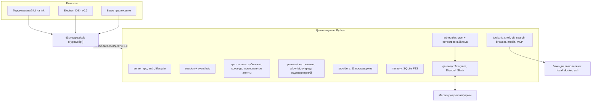

<h1 align="center">snowpea 🌱</h1>

<p align="center"><b>Открытый мультивендорный агент для кодинга — и ваш личный ИИ-ассистент.</b></p>

<p align="center">
  <a href="README.md">English</a> ·
  <a href="README.ko.md">한국어</a> ·
  <a href="README.ja.md">日本語</a> ·
  <a href="README.zh-CN.md">简体中文</a> ·
  <a href="README.zh-TW.md">繁體中文</a> ·
  <a href="README.es.md">Español</a> ·
  <a href="README.fr.md">Français</a> ·
  <a href="README.de.md">Deutsch</a> ·
  <a href="README.pt-BR.md">Português (BR)</a> ·
  <a href="README.ru.md">Русский</a>
</p>

<p align="center">
  <a href="LICENSE"></a>
  
  
  <a href="https://github.com/Wafour-Developer/snowpea-agent/actions/workflows/ci.yml"></a>
</p>

---

snowpea — это агент для кодинга, который работает на вашей собственной машине и подчиняется только той модели, за которую вы платите. Ядро на Python работает как локальный демон и владеет сессиями, инструментами, правами доступа, памятью, расписаниями и привязками к мессенджерам; терминальный интерфейс на Ink подключается к нему по документированному протоколу WebSocket JSON-RPC; а SDK на TypeScript открывает этот же протокол для всего остального, что вы захотите построить поверх него. Одиннадцать поставщиков LLM, выполнение локально/в Docker/по SSH, долговременная память, планировщик на cron и шлюзы Telegram/Discord/Slack — всё это стоит за одной командой: `snowpea`. Поскольку агент продолжает работать после того, как вы закрыли терминал, днём он агент для кодинга, а в остальное время — личный ассистент.

<table>
<tr><td><b>Своя модель, а не чужая</b></td><td>Одиннадцать поставщиков за одним интерфейсом — Anthropic, OpenAI, OpenRouter, Gemini, xAI, GLM, MiniMax, Kimi, DeepSeek, Qwen и любой OpenAI-совместимый эндпоинт, который вы хостите сами. Переключайтесь по сессиям без изменений в коде.</td></tr>
<tr><td><b>Модель прав, с которой можно жить</b></td><td>Три режима — plan, accept (по умолчанию), auto. Чтение и редактирование проходят свободно; shell, сеть и отправка сообщений спрашивают подтверждение. Allowlist превращает надоевшие запросы в тихие одобрения — для проекта или глобально.</td></tr>
<tr><td><b>Настоящий протокол, а не приватный чёрный ход</b></td><td>Каждая возможность сначала становится методом JSON-RPC, и только потом — частью UI. Схема генерируется из одного файла Python в <a href="docs/protocol.md">docs/protocol.md</a> и <code>sdk/src/protocol.ts</code>, и CI падает, если они расходятся.</td></tr>
<tr><td><b>Делегирует и распараллеливает</b></td><td>Одноразовые субагенты работают одновременно в пределах настраиваемого лимита, командный режим выделяет каждому воркеру собственный git worktree и сливает их ветки, а именованные агенты переживают перезапуск демона вместе со своей памятью и каналами.</td></tr>
<tr><td><b>Помнит между сессиями</b></td><td>Долговременная память на SQLite FTS плюс профиль пользователя. Релевантные воспоминания подмешиваются в системный промпт и цитируются в ответе по id.</td></tr>
<tr><td><b>Работает, пока вас нет</b></td><td>Планировщик на cron и естественном языке работает внутри демона и доставляет результаты в Telegram, Discord или Slack. Запросы на подтверждение приходят в тот же чат в виде кнопок и истекают отказом, если никто не ответил.</td></tr>
<tr><td><b>Выполняется там, где код</b></td><td>Один и тот же набор инструментов работает локально, внутри контейнера Docker или по SSH на другой машине. Переключайтесь прямо посреди сессии командой <code>/backend</code>.</td></tr>
<tr><td><b>Говорит на языке плагинов Claude Code</b></td><td>Устанавливает плагины, написанные для Claude Code, — <code>plugin.json</code>, скиллы <code>SKILL.md</code>, markdown-описания агентов и команд, хуки, серверы <code>.mcp.json</code> — и ищет по трём маркетплейсам одной командой.</td></tr>
</table>

---

## Быстрая установка

**macOS, Linux, WSL2**

```bash
curl -fsSL https://raw.githubusercontent.com/Wafour-Developer/snowpea-agent/main/installer/install.sh | sh
```

**Windows (PowerShell)**

```powershell
iwr https://raw.githubusercontent.com/Wafour-Developer/snowpea-agent/main/installer/install.ps1 | iex
```

Установщик разворачивает [uv](https://docs.astral.sh/uv/) и Node 20+, если их не хватает, устанавливает команду `snowpea` и печатает версию, которая в итоге получилась. Ничего не запускается в фоне, пока вы сами это не запустите. Ручной путь установки и действия на случай сбоя шага — в [docs/manual/en/install.md](docs/manual/en/install.md).

## Быстрый старт

```bash
snowpea setup                      # выберите поставщика, вставьте ключ или войдите через браузер
snowpea                            # открыть терминальный интерфейс
snowpea -c "что делает этот репозиторий?"   # один headless-ход, затем выход
```

`snowpea setup` записывает `$SNOWPEA_HOME/settings.json` (по умолчанию `~/.snowpea`). `snowpea` запускает демон, если он ещё не запущен, и подключает к нему TUI; второй запуск `snowpea` в другом терминале переиспользует тот же демон. `snowpea -c` полностью пропускает интерфейс — это та форма, которая нужна в скриптах и CI:

```bash
snowpea -c "добавь регрессионный тест для парсера" --mode auto
snowpea -c "сделай сводку сегодняшнего diff" --json --cwd ~/src/myproject
```

Headless-запуски выводят потоком записи `session.event` в формате JSON Lines под флагом `--json` и завершаются детерминированным кодом выхода: `0` — готово, `1` — агент сдался, `2` — ошибка использования, `3` — нет демона, `4` — отклонено или заблокировано режимом, `5` — таймаут. Подробности в [headless.md](docs/manual/en/headless.md).

## Архитектура



Демон привязывает loopback-порт, выбранный при старте, и записывает его вместе с токеном в `$SNOWPEA_HOME/daemon.json`. Три HTTP-эндпоинта только для чтения (`/health`, `/version`, `/protocol.json`) сидят на том же порту для проб; каждый вызов, меняющий состояние, идёт только через WebSocket. [ARCHITECTURE.md](docs/ARCHITECTURE.md) отображает модули, а [docs/protocol.md](docs/protocol.md) — сгенерированный справочник.

## Поставщики

В v0.1 поставляется одиннадцать поставщиков. Двое поддерживают вход через браузер; остальные требуют API-ключ.

| Поставщик | Адаптер | Вход |
|---|---|---|
| Anthropic | нативный Messages API | API-ключ |
| OpenAI | OpenAI-совместимый | API-ключ или **вход через браузер** (device code) |
| OpenRouter | OpenAI-совместимый | API-ключ или **вход через браузер** (OAuth PKCE) |
| Google Gemini | нативный | API-ключ |
| xAI Grok | OpenAI-совместимый | API-ключ |
| Zhipu GLM | OpenAI-совместимый | API-ключ |
| MiniMax | OpenAI-совместимый | API-ключ |
| Moonshot Kimi | OpenAI-совместимый | API-ключ |
| DeepSeek | OpenAI-совместимый | API-ключ |
| Qwen | OpenAI-совместимый | API-ключ |
| Локальный OpenAI-совместимый (vLLM, Ollama, LM Studio) | OpenAI-совместимый | base URL, ключ опционален |

```bash
snowpea provider list                          # что доступно и что настроено
snowpea provider login openai                  # код устройства в терминале, подтверждение в браузере
snowpea setup --vendor deepseek --key sk-...   # неинтерактивно
```

Поставщики различаются формой tool-call, дельтами стриминга и поддержкой параллельных вызовов инструментов. Всё это нормализуется в одном месте и объявляется для каждого поставщика как набор пресетных флагов, поэтому добавление двенадцатого поставщика — это запись в пресете, а не новый путь в коде. См. [setup.md](docs/manual/en/setup.md).

## Режимы и подтверждения

| | чтение | запись / редактирование | shell | сеть | отправка |
|---|---|---|---|---|---|
| **plan** | разрешено | запрещено | запрещено | разрешено | запрещено |
| **accept** (по умолчанию) | разрешено | разрешено | спросить | спросить | спросить |
| **auto** | разрешено | разрешено | разрешено | разрешено | разрешено |

Переключайтесь командами `/plan`, `/accept`, `/auto` в интерфейсе, флагом `--mode` в командной строке, либо сохраните значение по умолчанию для проекта командой `/mode save` в `<project>/.snowpea/settings.json`. Когда запрос становится навязчивым, повысьте его до правила:

```
/allow ^ls( .*)?$
/allow ^git (status|diff|log)\b --global
```

Запись в allowlist только превращает *ask* в *allow*; она никогда не может разблокировать то, что запрещено режимом. Всё одобренное или отклонённое дописывается в `$SNOWPEA_HOME/logs/approvals.jsonl`. Подробнее в [modes.md](docs/manual/en/modes.md).

## Встроенные команды

```
/help        /tools       /mode        /allow       /allowlist    /backend
/plan        /accept      /auto        /approvals   /schedule
/agent       /skill       /ralph       /ultrawork   /deepinit
/deep-interview           /deep-research            /ralplan
```

- **`/ralph <task>`** пишет небольшой PRD из пользовательских историй с критериями приёмки, а затем зацикливается — реализует через субагентов, запускает команды проверки, указанные в истории, отмечает её как пройденную — пока субагент-ревьюер не ответит APPROVE.
- **`/ultrawork <task>`** разбивает задачу на независимые части, раздаёт их параллельным субагентам и сливает отчёты.
- **`/deepinit`** обходит репозиторий и пишет иерархическую документацию `AGENTS.md`.
- **`/deep-interview`**, **`/deep-research`** и **`/ralplan`** поставляются как файлы `SKILL.md`, загружаемые через тот же загрузчик, что и ваши собственные скиллы, так что вы можете читать и редактировать их промпты.
- **`/agent create "<description>"`** генерирует определение агента в `<project>/.snowpea/agents/<name>.md`, сразу пригодное как цель для `delegate_task`. **`/skill learn`** превращает только что завершённую сессию в переиспользуемый `SKILL.md`.
- **`/team <n> <task>`** выделяет каждому из n воркеров git worktree и сливает их ветки по мере завершения задач.

Слэш-команды живут в ядре, а не в интерфейсе, поэтому одна и та же `/ralph` выполняется из TUI, из `snowpea -c "/ralph ..."`, из запланированного задания и из сообщения в чате. `snowpea commands list --json` печатает живой реестр. Полный справочник: [commands.md](docs/manual/en/commands.md).

## Плагины и скиллы

snowpea читает структуру плагинов Claude Code как есть: `plugin.json`, `skills/<name>/SKILL.md`, `agents/*.md`, `commands/*.md`, `hooks/hooks.json` и серверы `.mcp.json`. Frontmatter скилла следует стандарту [agentskills.io](https://agentskills.io), а его тело становится `/`-командой.

```bash
snowpea skill search "pdf"           # ищет по claude-marketplace, agentskills.io и hermes-hub
snowpea skill install oh-my-claudecode
snowpea skill list
```

Сканируются оба локальных для проекта каталога — `<project>/.snowpea/` и `<project>/.claude/`, — так что репозиторий, уже настроенный под Claude Code, работает без изменений. [plugins.md](docs/manual/en/plugins.md) описывает приоритеты, хуки и серверы MCP.

## Планировщик и шлюз мессенджеров

```bash
snowpea job schedule --at "0 9 * * *" --task "сделать сводку вчерашних коммитов" --channel telegram:123456
snowpea job list
snowpea gateway bind telegram TELEGRAM_BOT_TOKEN agent:scribe --user 987654
```

Задания выполняются внутри демона, в том режиме, с которым были зарегистрированы, и доставляют ответ в указанный канал. Расписание может быть в формате cron, `in 10m`, `every 30m` или на естественном языке — английском или корейском. Когда автономный запуск требует подтверждения, оно приходит в привязанный чат с кнопками разрешить/отклонить, одновременно появляется в очереди подтверждений TUI, принимается тот ответ, который пришёл первым, а по истечении `approvals.timeoutSec` (по умолчанию 300) истекает отказом. Подтвердить может только привязанный id пользователя. См. [scheduler.md](docs/manual/en/scheduler.md) и [gateway.md](docs/manual/en/gateway.md).

## Бэкенды выполнения

Набор инструментов одинаков независимо от того, работает ли он на вашей машине, в контейнере или на удалённом хосте — инструменты всегда проходят через бэкенд, никогда напрямую в файловую систему.

```
/backend docker {"image": "python:3.11-slim"}
/backend ssh {"host": "10.0.0.5", "user": "build", "key": "~/.ssh/id_ed25519"}
/backend local
```

[backends.md](docs/manual/en/backends.md) содержит настройки для каждого.

## Сравнение

| | snowpea | Claude Code | Codex CLI | opencode | Hermes |
|---|---|---|---|---|---|
| Лицензия | MIT | проприетарная | открытый исходный код | открытый исходный код | MIT |
| Поставщики | 11, один интерфейс | Anthropic | ориентирован на OpenAI | множество | множество |
| Клиентский протокол | WS JSON-RPC, документирован, TS SDK | внутренний | app-server JSON-RPC | HTTP + SSE | внутренний |
| Режимы прав | plan / accept / auto + allowlist | plan / acceptEdits / bypass | политики подтверждения | конфигурация прав | подтверждение команд |
| Формат плагинов | плагины Claude Code + SKILL.md | плагины Claude Code | — | плагины на TypeScript | скиллы agentskills.io |
| Шлюз мессенджеров | Telegram, Discord, Slack | — | — | — | шесть платформ |
| Планировщик | cron + естественный язык, в демоне | — | — | — | cron |
| Бэкенды выполнения | local, Docker, SSH | local | local, sandbox | local | семь бэкендов |
| Командный режим | общий список задач + git worktree | субагенты | — | — | субагенты |

Строки описывают snowpea v0.1 в сравнении с этими проектами на момент написания; остальные проекты быстро развиваются, так что перед тем как полагаться на ячейку, сверьтесь с их собственной документацией.

## Документация

| Страница | Что в ней |
|---|---|
| [Установка](docs/manual/en/install.md) | однострочная установка, ручная установка, обновление, удаление |
| [Настройка](docs/manual/en/setup.md) | экраны мастера, все одиннадцать поставщиков, вход через браузер, провайдеры поиска и браузера |
| [Режимы](docs/manual/en/modes.md) | plan/accept/auto, матрица прав, allowlist, настройки проекта |
| [Команды](docs/manual/en/commands.md) | каждая встроенная команда и подкоманда CLI |
| [Плагины](docs/manual/en/plugins.md) | формат плагинов Claude Code, SKILL.md, хуки, MCP, маркетплейсы |
| [Планировщик](docs/manual/en/scheduler.md) | задания на cron и естественном языке, каналы доставки |
| [Шлюз](docs/manual/en/gateway.md) | Telegram, Discord, Slack, подтверждения без присмотра |
| [Бэкенды](docs/manual/en/backends.md) | local, Docker, SSH |
| [Headless](docs/manual/en/headless.md) | `-c`, JSON Lines, коды выхода, использование в CI |
| [Протокол](docs/manual/en/protocol.md) | рукопожатие, методы, события, версионирование |
| [Архитектура](docs/ARCHITECTURE.md) | карта модулей, диаграммы, ворота заморозки протокола |
| [Вклад в проект](docs/CONTRIBUTING.md) | настройка окружения разработки, тесты, добавление поставщика, инструмента или команды |

Руководство также доступно на [корейском](docs/manual/ko/index.md), а его страницы про установку/настройку/команды — на [японском](docs/manual/ja/install.md), [упрощённом китайском](docs/manual/zh-CN/install.md) и [испанском](docs/manual/es/install.md). Указатель всех страниц и языков: [docs/manual/README.md](docs/manual/README.md).

## Дорожная карта

- **v0.1 — этот репозиторий.** Демон-ядро, протокол, TUI, SDK, одиннадцать поставщиков, инструменты, память, планировщик, шлюз, плагины, субагенты и командный режим, установщики для трёх платформ.
- **v0.2 — настольная IDE.** Приложение на Electron поверх того же SDK, с подтверждением diff по каждому файлу, деревом субагентов, параллельными сессиями на worktree и браузером скиллов. Начнётся только после того, как протокол пройдёт ворота заморозки v1.0: три релиза подряд без изменений в сгенерированной схеме.
- **v0.3 — сайт и реестр.** snowpea.ai для лендинга и руководства, плюс реестр скиллов с загрузкой, рейтингами и курированием, подключённый к `snowpea skill search`. URL установки в этот момент переезжает с GitHub raw на snowpea.ai.

## Вклад в проект

```bash
git clone https://github.com/Wafour-Developer/snowpea-agent.git
cd snowpea-agent
uv sync && npm ci
uv run pytest -q
```

Прочитайте [docs/CONTRIBUTING.md](docs/CONTRIBUTING.md) ([한국어](docs/CONTRIBUTING.ko.md)) перед первым pull request — там описана проверка сгенерированного протокола, проверка целостности vendored-кода и то, куда встраиваются новые поставщики, инструменты, команды и провайдеры поиска.

## Лицензия и благодарности

snowpea распространяется под лицензией MIT ([LICENSE](LICENSE)).

Проект опирается на два проекта под лицензией MIT. Часть набора инструментов и практическая механика шлюзов, планирования и памяти заимствованы (vendored) из [hermes-agent](https://github.com/NousResearch/hermes-agent) от Nous Research; несколько встроенных команд и скиллов портированы из [oh-my-claudecode](https://github.com/Yeachan-Heo/oh-my-claudecode). Vendored-код находится в `core/snowpea_core/vendor/hermes/`, сохраняет свой оригинальный заголовок и зафиксирован по коммиту и хешу файлов апстрима — наши собственные изменения коммитятся как патчи, и CI проверяет, что «апстрим + патч» равно рабочей копии. Авторитетные таблицы — [docs/vendoring-map.md](docs/vendoring-map.md) и [docs/omc-porting-map.md](docs/omc-porting-map.md); указание авторства — в [NOTICE](NOTICE).
