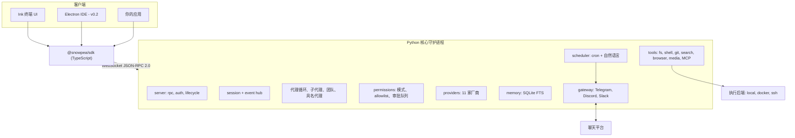

<h1 align="center">snowpea 🌱</h1>

<p align="center"><b>一款开源的多厂商编程代理 —— 也是你自己的 AI 助手。</b></p>

<p align="center">
  <a href="README.md">English</a> ·
  <a href="README.ko.md">한국어</a> ·
  <a href="README.ja.md">日本語</a> ·
  <a href="README.zh-CN.md">简体中文</a> ·
  <a href="README.zh-TW.md">繁體中文</a> ·
  <a href="README.es.md">Español</a> ·
  <a href="README.fr.md">Français</a> ·
  <a href="README.de.md">Deutsch</a> ·
  <a href="README.pt-BR.md">Português (BR)</a> ·
  <a href="README.ru.md">Русский</a>
</p>

<p align="center">
  <a href="LICENSE"></a>
  
  
  <a href="https://github.com/Wafour-Developer/snowpea-agent/actions/workflows/ci.yml"></a>
</p>

---

snowpea 是一款运行在你自己机器上的编程代理,只听命于你付费使用的那个模型。Python 核心以本地守护进程的形式常驻,统一掌管会话、工具、权限、记忆、日程和消息机器人绑定;一个 Ink 编写的终端 UI 通过一套有文档记载的 WebSocket JSON-RPC 协议接入该守护进程;同一套协议也通过 TypeScript SDK 向外开放,供你构建任何其他应用。十一家 LLM 厂商、本地/Docker/SSH 执行、长期记忆、cron 调度器以及 Telegram/Discord/Slack 网关,全都收拢在一条命令背后:`snowpea`。因为代理在你关掉终端后仍会继续运行,它白天是编程代理,其余时间则是你的私人助手。

<table>
<tr><td><b>自带模型</b></td><td>一个接口背后是十一家厂商 —— Anthropic、OpenAI、OpenRouter、Gemini、xAI、GLM、MiniMax、Kimi、DeepSeek、Qwen,以及任何你自己搭建的 OpenAI 兼容端点。按会话切换,无需改代码。</td></tr>
<tr><td><b>一套你能接受的权限模型</b></td><td>三种模式 —— plan、accept(默认)、auto。读取与编辑直接放行;shell、网络和发送类操作会询问。厌倦了的提示可以加入 allowlist,按项目或全局静默通过。</td></tr>
<tr><td><b>是真协议,不是私有后门</b></td><td>每项能力在成为 UI 之前都先是一个 JSON-RPC 方法。schema 由同一个 Python 文件生成到 <a href="docs/protocol.md">docs/protocol.md</a> 和 <code>sdk/src/protocol.ts</code> 中,一旦两者出现偏差 CI 就会失败。</td></tr>
<tr><td><b>委派与并行</b></td><td>一次性子代理在可配置的并发上限内同时运行,团队模式为每个工作者分配各自的 git worktree 并合并分支,具名代理则带着各自的记忆和频道跨守护进程重启持续存在。</td></tr>
<tr><td><b>跨会话记忆</b></td><td>SQLite FTS 长期记忆加用户画像。相关记忆会被注入系统提示词,并在回答中以 id 形式引用。</td></tr>
<tr><td><b>你不在时也在工作</b></td><td>cron 与自然语言调度器在守护进程内运行,并把结果发送到 Telegram、Discord 或 Slack。审批请求也会以按钮形式发到同一个聊天窗口,若无人回应则超时自动拒绝。</td></tr>
<tr><td><b>代码在哪就在哪运行</b></td><td>同一套工具在你本机、Docker 容器内,或 SSH 连接的另一台机器上执行方式完全一致。用 <code>/backend</code> 在会话中途切换。</td></tr>
<tr><td><b>读懂 Claude Code 插件</b></td><td>可直接安装为 Claude Code 编写的插件 —— <code>plugin.json</code>、<code>SKILL.md</code> 技能、代理与命令的 markdown、hooks、<code>.mcp.json</code> 服务器 —— 并用一条命令搜索三个应用市场。</td></tr>
</table>

---

## 快速安装

**macOS、Linux、WSL2**

```bash
curl -fsSL https://raw.githubusercontent.com/Wafour-Developer/snowpea-agent/main/installer/install.sh | sh
```

**Windows(PowerShell)**

```powershell
iwr https://raw.githubusercontent.com/Wafour-Developer/snowpea-agent/main/installer/install.ps1 | iex
```

安装脚本会在缺失时补齐 [uv](https://docs.astral.sh/uv/) 和 Node 20+,注册 `snowpea` 命令,并打印最终安装的版本号。在你主动启动之前,不会有任何后台进程运行。手动安装路径以及某一步失败时的处理办法见 [docs/manual/en/install.md](docs/manual/en/install.md)。

## 快速开始

```bash
snowpea setup                      # 选择一家厂商,粘贴密钥或通过浏览器登录
snowpea                            # 打开终端 UI
snowpea -c "这个仓库是做什么的?"   # 无头模式跑一轮,然后退出
```

`snowpea setup` 会写入 `$SNOWPEA_HOME/settings.json`(默认为 `~/.snowpea`)。`snowpea` 会在守护进程尚未运行时启动它,并把 TUI 接上去;在另一个终端再次执行 `snowpea` 会复用同一个守护进程。`snowpea -c` 完全跳过 UI,是脚本和 CI 中你想要的形态:

```bash
snowpea -c "为解析器加一个回归测试" --mode auto
snowpea -c "总结今天的 diff" --json --cwd ~/src/myproject
```

无头运行在 `--json` 下会以 JSON Lines 的形式流式输出 `session.event` 记录,并以确定性的退出码结束:`0` 完成,`1` 代理放弃,`2` 用法错误,`3` 无守护进程,`4` 被拒绝或被模式阻止,`5` 超时。详情见 [headless.md](docs/manual/en/headless.md)。

## 架构



守护进程在启动时选定一个回环端口,并连同一个令牌一起记录到 `$SNOWPEA_HOME/daemon.json`。同一端口上有三个只读的 HTTP 端点(`/health`、`/version`、`/protocol.json`)供探测使用;所有会改变状态的调用一律只走 WebSocket。[ARCHITECTURE.md](docs/ARCHITECTURE.md) 描绘了各模块,[docs/protocol.md](docs/protocol.md) 是自动生成的参考文档。

## 厂商

v0.1 内置十一家厂商。其中两家支持浏览器登录,其余使用 API 密钥。

| 厂商 | 适配器 | 登录方式 |
|---|---|---|
| Anthropic | 原生 Messages API | API 密钥 |
| OpenAI | OpenAI 兼容 | API 密钥或**浏览器登录**(设备码) |
| OpenRouter | OpenAI 兼容 | API 密钥或**浏览器登录**(OAuth PKCE) |
| Google Gemini | 原生 | API 密钥 |
| xAI Grok | OpenAI 兼容 | API 密钥 |
| Zhipu GLM | OpenAI 兼容 | API 密钥 |
| MiniMax | OpenAI 兼容 | API 密钥 |
| Moonshot Kimi | OpenAI 兼容 | API 密钥 |
| DeepSeek | OpenAI 兼容 | API 密钥 |
| Qwen | OpenAI 兼容 | API 密钥 |
| 本地 OpenAI 兼容(vLLM、Ollama、LM Studio) | OpenAI 兼容 | base URL,密钥可选 |

```bash
snowpea provider list                          # 有哪些厂商可用、哪些已配置
snowpea provider login openai                  # 终端显示设备码,在浏览器中确认
snowpea setup --vendor deepseek --key sk-...   # 非交互式
```

各厂商在 tool-call 的形态、流式增量以及并行工具调用支持上各不相同。这些差异全部在一处被归一化处理,并按厂商声明为预设标志,因此接入第十二家厂商只是新增一条预设,而不是新增一条代码路径。详见 [setup.md](docs/manual/en/setup.md)。

## 模式与审批

| | 读取 | 写入/编辑 | shell | 网络 | 发送 |
|---|---|---|---|---|---|
| **plan** | 允许 | 拒绝 | 拒绝 | 允许 | 拒绝 |
| **accept**(默认) | 允许 | 允许 | 询问 | 询问 | 询问 |
| **auto** | 允许 | 允许 | 允许 | 允许 | 允许 |

在 UI 中用 `/plan`、`/accept`、`/auto` 切换,在命令行中用 `--mode`,或用 `/mode save` 把项目默认值持久化到 `<project>/.snowpea/settings.json`。当某个提示反复出现变得烦人时,把它提升为免询问:

```
/allow ^ls( .*)?$
/allow ^git (status|diff|log)\b --global
```

allowlist 条目只能把*询问*变为*允许*;它永远无法解锁被模式拒绝的操作。所有被批准或拒绝的操作都会追加写入 `$SNOWPEA_HOME/logs/approvals.jsonl`。更多内容见 [modes.md](docs/manual/en/modes.md)。

## 内置命令

```
/help        /tools       /mode        /allow       /allowlist    /backend
/plan        /accept      /auto        /approvals   /schedule
/agent       /skill       /ralph       /ultrawork   /deepinit
/deep-interview           /deep-research            /ralplan
```

- **`/ralph <task>`** 会先写出一份带验收标准的用户故事小型 PRD,然后循环执行 —— 用子代理实现、运行故事中指定的验证命令、标记为通过 —— 直到一个审阅子代理回答 APPROVE 为止。
- **`/ultrawork <task>`** 把任务拆成互不依赖的部分,分发给并发运行的子代理,再合并各自的报告。
- **`/deepinit`** 遍历整个仓库,写出分层的 `AGENTS.md` 文档。
- **`/deep-interview`**、**`/deep-research`** 和 **`/ralplan`** 以 `SKILL.md` 文件的形式提供,通过你自己的技能所使用的同一个加载器读取,因此你可以直接阅读和修改它们的提示词。
- **`/agent create "<description>"`** 会在 `<project>/.snowpea/agents/<name>.md` 生成一份代理定义,可立即作为 `delegate_task` 的目标使用。**`/skill learn`** 会把你刚结束的会话转化为一份可复用的 `SKILL.md`。
- **`/team <n> <task>`** 为 n 个工作者各自分配一个 git worktree,并在任务完成时合并各自的分支。

斜杠命令存在于核心中,而不是 UI 中,因此同一个 `/ralph` 无论从 TUI、从 `snowpea -c "/ralph ..."`、从定时任务,还是从一条聊天消息触发,行为都一致。`snowpea commands list --json` 会打印当前的实时命令注册表。完整参考见 [commands.md](docs/manual/en/commands.md)。

## 插件与技能

snowpea 原样读取 Claude Code 的插件布局:`plugin.json`、`skills/<name>/SKILL.md`、`agents/*.md`、`commands/*.md`、`hooks/hooks.json`,以及 `.mcp.json` 服务器。技能的 front matter 遵循 [agentskills.io](https://agentskills.io) 标准,其正文会变成一个 `/` 命令。

```bash
snowpea skill search "pdf"           # 搜索 claude-marketplace、agentskills.io 和 hermes-hub
snowpea skill install oh-my-claudecode
snowpea skill list
```

项目本地的 `<project>/.snowpea/` 和 `<project>/.claude/` 两个目录都会被扫描,因此一个已经为 Claude Code 配置好的仓库无需任何改动即可使用。[plugins.md](docs/manual/en/plugins.md) 讲解了优先级、hooks 和 MCP 服务器。

## 调度器与消息网关

```bash
snowpea job schedule --at "0 9 * * *" --task "总结昨天的提交" --channel telegram:123456
snowpea job list
snowpea gateway bind telegram TELEGRAM_BOT_TOKEN agent:scribe --user 987654
```

任务在守护进程内运行,使用你注册它时指定的模式,并把结果发送到你指定的频道。时间规格可以是 cron、`in 10m`、`every 30m`,也可以是英语或韩语的自然语言。当一次无人值守的运行需要审批时,请求会连同允许/拒绝按钮一起发到绑定的聊天窗口,同时也会出现在 TUI 的审批队列中,以先到的回答为准,并在 `approvals.timeoutSec`(默认 300 秒)后超时自动拒绝。只有绑定的用户 id 可以批准。参见 [scheduler.md](docs/manual/en/scheduler.md) 和 [gateway.md](docs/manual/en/gateway.md)。

## 执行后端

无论运行在你的机器上、容器内,还是远程主机上,工具套件都完全一致 —— 工具始终经由后端执行,从不直接触碰文件系统。

```
/backend docker {"image": "python:3.11-slim"}
/backend ssh {"host": "10.0.0.5", "user": "build", "key": "~/.ssh/id_ed25519"}
/backend local
```

各自的配置详见 [backends.md](docs/manual/en/backends.md)。

## 与同类工具的对比

| | snowpea | Claude Code | Codex CLI | opencode | Hermes |
|---|---|---|---|---|---|
| 许可证 | MIT | 专有 | 开源 | 开源 | MIT |
| 厂商 | 11 家,单一接口 | Anthropic | 以 OpenAI 为中心 | 多家 | 多家 |
| 客户端协议 | 有文档记载的 WS JSON-RPC + TS SDK | 内部实现 | app-server JSON-RPC | HTTP + SSE | 内部实现 |
| 权限模式 | plan / accept / auto + allowlist | plan / acceptEdits / bypass | 审批策略 | 权限配置 | 命令审批 |
| 插件格式 | Claude Code 插件 + SKILL.md | Claude Code 插件 | — | TypeScript 插件 | agentskills.io 技能 |
| 消息网关 | Telegram、Discord、Slack | — | — | — | 六个平台 |
| 调度器 | 守护进程内 cron + 自然语言 | — | — | — | cron |
| 执行后端 | local、Docker、SSH | local | local、沙箱 | local | 七种后端 |
| 团队模式 | 共享任务列表 + git worktree | 子代理 | — | — | 子代理 |

以上各行是撰写时 snowpea v0.1 与这些项目的对比;其他项目迭代很快,在依赖某个格子的内容前请查阅它们各自的文档。

## 文档

| 页面 | 内容 |
|---|---|
| [安装](docs/manual/en/install.md) | 一键安装、手动安装、升级、卸载 |
| [设置](docs/manual/en/setup.md) | 向导界面、全部十一家厂商、浏览器登录、搜索与浏览器提供方 |
| [模式](docs/manual/en/modes.md) | plan/accept/auto、权限矩阵、allowlist、项目设置 |
| [命令](docs/manual/en/commands.md) | 每一条内置命令和 CLI 子命令 |
| [插件](docs/manual/en/plugins.md) | Claude Code 插件格式、SKILL.md、hooks、MCP、应用市场 |
| [调度器](docs/manual/en/scheduler.md) | cron 与自然语言任务、投递频道 |
| [网关](docs/manual/en/gateway.md) | Telegram、Discord、Slack、无人值守审批 |
| [后端](docs/manual/en/backends.md) | local、Docker、SSH |
| [无头模式](docs/manual/en/headless.md) | `-c`、JSON Lines、退出码、CI 用法 |
| [协议](docs/manual/en/protocol.md) | 握手、方法、事件、版本策略 |
| [架构](docs/ARCHITECTURE.md) | 模块地图、图示、协议冻结门禁 |
| [贡献指南](docs/CONTRIBUTING.md) | 开发环境搭建、测试、新增厂商/工具/命令 |

该手册还有[韩语](docs/manual/ko/index.md)版本,其安装/设置/命令页面还有[日语](docs/manual/ja/install.md)、[简体中文](docs/manual/zh-CN/install.md)和[西班牙语](docs/manual/es/install.md)版本。所有页面和语言的索引见 [docs/manual/README.md](docs/manual/README.md)。

## 路线图

- **v0.1 —— 本仓库。** 核心守护进程、协议、TUI、SDK、十一家厂商、工具套件、记忆、调度器、网关、插件、子代理与团队模式,三大平台的安装脚本。
- **v0.2 —— 桌面 IDE。** 一个基于同一 SDK 的 Electron 应用,支持逐文件 diff 审批、子代理树、worktree 并行会话和技能浏览器。它只有在协议通过 v1.0 冻结门禁(连续三次发布生成 schema 无任何变化)之后才会启动。
- **v0.3 —— 官网与技能注册中心。** snowpea.ai 用作落地页和手册,并将带上传、评分和策展功能的技能注册中心接入 `snowpea skill search`。届时安装 URL 会从 GitHub raw 迁移到 snowpea.ai。

## 贡献

```bash
git clone https://github.com/Wafour-Developer/snowpea-agent.git
cd snowpea-agent
uv sync && npm ci
uv run pytest -q
```

在提交第一个 PR 之前,请阅读 [docs/CONTRIBUTING.md](docs/CONTRIBUTING.md)([한국어](docs/CONTRIBUTING.ko.md))—— 其中涵盖生成协议检查、vendored 代码完整性检查,以及新厂商、工具、命令和搜索提供方应挂接在何处。

## 许可证与致谢

snowpea 采用 MIT 许可证([LICENSE](LICENSE))。

它建立在两个 MIT 许可的项目之上。工具套件的一部分,以及网关、调度和记忆背后的实务机制,vendored 自 Nous Research 的 [hermes-agent](https://github.com/NousResearch/hermes-agent);若干内置命令和技能则移植自 [oh-my-claudecode](https://github.com/Yeachan-Heo/oh-my-claudecode)。vendored 代码位于 `core/snowpea_core/vendor/hermes/` 下,保留其上游头部信息,并按上游提交和文件哈希锁定 —— 我们自己的修改以补丁形式提交,CI 会验证"上游 + 补丁 == 工作副本"。权威对照表见 [docs/vendoring-map.md](docs/vendoring-map.md) 和 [docs/omc-porting-map.md](docs/omc-porting-map.md);署名信息见 [NOTICE](NOTICE)。
</content>
</invoke>
