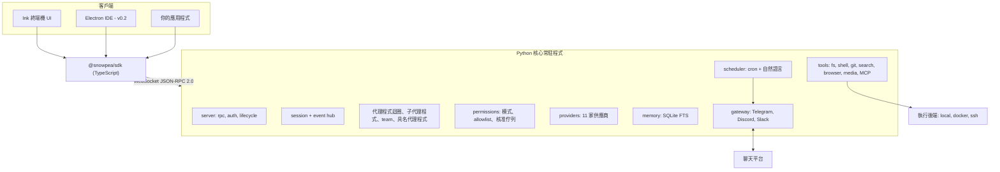

<h1 align="center">snowpea 🌱</h1>

<p align="center"><b>開源、多供應商的編碼代理程式——也是你專屬的 AI 助理。</b></p>

<p align="center">
  <a href="README.md">English</a> ·
  <a href="README.ko.md">한국어</a> ·
  <a href="README.ja.md">日本語</a> ·
  <a href="README.zh-CN.md">简体中文</a> ·
  <a href="README.zh-TW.md">繁體中文</a> ·
  <a href="README.es.md">Español</a> ·
  <a href="README.fr.md">Français</a> ·
  <a href="README.de.md">Deutsch</a> ·
  <a href="README.pt-BR.md">Português (BR)</a> ·
  <a href="README.ru.md">Русский</a>
</p>

<p align="center">
  <a href="LICENSE"></a>
  
  
  <a href="https://github.com/Wafour-Developer/snowpea-agent/actions/workflows/ci.yml"></a>
</p>

---

snowpea 是一個在你自己的機器上執行、只聽命於你付費模型的編碼代理程式。Python 核心以本機常駐程式（daemon）的形式執行，擁有並管理 session、工具、權限、記憶、排程與訊息平台綁定；Ink 製作的終端機 UI 透過一份有完整文件的 WebSocket JSON-RPC 協定連接到這個常駐程式；而 TypeScript SDK 則把同一份協定開放給你想在其上打造的任何其他東西。十一家 LLM 供應商、本機／Docker／SSH 執行環境、長期記憶、cron 排程器，以及 Telegram／Discord／Slack 閘道，全都藏在一個指令背後：`snowpea`。因為代理程式在你關閉終端機之後仍會繼續執行，它白天是編碼代理程式，其餘時間則是你的個人助理。

<table>
<tr><td><b>沿用你自己的模型</b></td><td>一個介面背後有十一家供應商——Anthropic、OpenAI、OpenRouter、Gemini、xAI、GLM、MiniMax、Kimi、DeepSeek、Qwen，以及任何你自行架設、相容 OpenAI 的端點。可依 session 切換，不需要改任何程式碼。</td></tr>
<tr><td><b>一套你能接受的權限模型</b></td><td>三種模式——plan、accept（預設）、auto。讀取與編輯會直接放行；shell、網路與傳送動作則會詢問。allowlist 能把你厭倦的提示變成靜默核准，可依專案或全域套用。</td></tr>
<tr><td><b>真正的協定，而非私有後門</b></td><td>每一項能力在成為 UI 之前，都先是一個 JSON-RPC 方法。schema 是由同一份 Python 檔案產生到 <a href="docs/protocol.md">docs/protocol.md</a> 與 <code>sdk/src/protocol.ts</code>，兩者一旦出現落差 CI 就會失敗。</td></tr>
<tr><td><b>委派與平行化</b></td><td>一次性子代理程式在可設定的上限內並行執行；team 模式會為每個工作者配置自己的 git worktree 並合併他們的分支；具名代理程式則在常駐程式重啟後仍持續存在，各自保有自己的記憶與頻道。</td></tr>
<tr><td><b>跨 session 記住內容</b></td><td>SQLite FTS 長期記憶加上使用者設定檔。相關記憶會被注入到系統提示詞中，並在回答裡以 id 引用。</td></tr>
<tr><td><b>你不在時也能工作</b></td><td>cron 與自然語言排程器在常駐程式內執行，並把結果送到 Telegram、Discord 或 Slack。核准請求也會以按鈕形式送到同一個聊天室，若無人回應就會逾時變成拒絕。</td></tr>
<tr><td><b>在程式碼所在之處執行</b></td><td>同一套工具在本機、Docker 容器內，或透過 SSH 在另一台機器上執行時完全一致。可用 <code>/backend</code> 在 session 進行中切換。</td></tr>
<tr><td><b>懂得 Claude Code 外掛語言</b></td><td>可安裝為 Claude Code 撰寫的外掛——<code>plugin.json</code>、<code>SKILL.md</code> 技能、代理程式與指令的 markdown、hooks、<code>.mcp.json</code> 伺服器——並用一個指令搜尋三個市集。</td></tr>
</table>

---

## 快速安裝

**macOS、Linux、WSL2**

```bash
curl -fsSL https://raw.githubusercontent.com/Wafour-Developer/snowpea-agent/main/installer/install.sh | sh
```

**Windows (PowerShell)**

```powershell
iwr https://raw.githubusercontent.com/Wafour-Developer/snowpea-agent/main/installer/install.ps1 | iex
```

安裝程式會在缺少 [uv](https://docs.astral.sh/uv/) 與 Node 20+ 時自動安裝，並註冊 `snowpea` 指令，最後印出安裝完成的版本。在你啟動它之前，不會有任何東西在背景執行。手動安裝路徑，以及步驟失敗時的處理方式，見 [docs/manual/en/install.md](docs/manual/en/install.md)。

## 快速上手

```bash
snowpea setup                      # 選擇供應商，貼上金鑰或透過瀏覽器登入
snowpea                            # 開啟終端機 UI
snowpea -c "這個 repo 是做什麼的？"   # 無介面執行一輪，然後結束
```

`snowpea setup` 會寫入 `$SNOWPEA_HOME/settings.json`（預設為 `~/.snowpea`）。`snowpea` 會在常駐程式尚未執行時啟動它，並把 TUI 連接上去；在另一個終端機再次執行 `snowpea` 會重複使用同一個常駐程式。`snowpea -c` 完全略過 UI，是你在腳本與 CI 中會想要的形式：

```bash
snowpea -c "為 parser 加一個回歸測試" --mode auto
snowpea -c "總結今天的 diff" --json --cwd ~/src/myproject
```

在 `--json` 之下，無介面執行會以 JSON Lines 串流輸出 `session.event` 紀錄，並以確定性的結束碼結束：`0` 完成、`1` 代理程式放棄、`2` 使用方式錯誤、`3` 沒有常駐程式、`4` 被拒絕或被模式阻擋、`5` 逾時。細節見 [headless.md](docs/manual/en/headless.md)。

## 架構



常駐程式在啟動時會選定一個 loopback port 並連同 token 一起記錄在 `$SNOWPEA_HOME/daemon.json`。同一個 port 上有三個唯讀的 HTTP 端點（`/health`、`/version`、`/protocol.json`）供健康檢查使用；每一個會改變狀態的呼叫都只經由 WebSocket。[ARCHITECTURE.md](docs/ARCHITECTURE.md) 描繪了各模組的關係，[docs/protocol.md](docs/protocol.md) 則是自動產生的參考文件。

## 供應商

v0.1 內建十一家供應商。其中兩家支援瀏覽器登入，其餘則使用 API 金鑰。

| 供應商 | 轉接器 | 登入方式 |
|---|---|---|
| Anthropic | 原生 Messages API | API 金鑰 |
| OpenAI | 相容 OpenAI | API 金鑰或**瀏覽器登入**（裝置代碼） |
| OpenRouter | 相容 OpenAI | API 金鑰或**瀏覽器登入**（OAuth PKCE） |
| Google Gemini | 原生 | API 金鑰 |
| xAI Grok | 相容 OpenAI | API 金鑰 |
| Zhipu GLM | 相容 OpenAI | API 金鑰 |
| MiniMax | 相容 OpenAI | API 金鑰 |
| Moonshot Kimi | 相容 OpenAI | API 金鑰 |
| DeepSeek | 相容 OpenAI | API 金鑰 |
| Qwen | 相容 OpenAI | API 金鑰 |
| 本機相容 OpenAI（vLLM、Ollama、LM Studio） | 相容 OpenAI | base URL，金鑰可選 |

```bash
snowpea provider list                          # 有哪些可用、目前設定了什麼
snowpea provider login openai                  # 終端機顯示裝置代碼，於瀏覽器中核准
snowpea setup --vendor deepseek --key sk-...   # 非互動模式
```

不同供應商在 tool-call 的形狀、串流 delta 與平行工具呼叫支援度上各有差異。這些差異全部在同一處被正規化，並以每家供應商的預設旗標宣告，所以新增第十二家供應商只是新增一筆預設項目，而不是新增一條程式碼路徑。詳見 [setup.md](docs/manual/en/setup.md)。

## 模式與核准

| | 讀取 | 寫入／編輯 | shell | 網路 | 傳送 |
|---|---|---|---|---|---|
| **plan** | 允許 | 拒絕 | 拒絕 | 允許 | 拒絕 |
| **accept**（預設） | 允許 | 允許 | 詢問 | 詢問 | 詢問 |
| **auto** | 允許 | 允許 | 允許 | 允許 | 允許 |

在 UI 中以 `/plan`、`/accept`、`/auto` 切換，在命令列上以 `--mode` 切換，或以 `/mode save` 把預設值寫入 `<project>/.snowpea/settings.json` 作為專案預設值。當某個提示變得重複時，把它升級：

```
/allow ^ls( .*)?$
/allow ^git (status|diff|log)\b --global
```

allowlist 項目只會把「詢問」變成「允許」；它永遠無法解除模式所拒絕的事項。所有被核准或拒絕的動作都會附加寫入 `$SNOWPEA_HOME/logs/approvals.jsonl`。更多內容見 [modes.md](docs/manual/en/modes.md)。

## 內建指令

```
/help        /tools       /mode        /allow       /allowlist    /backend
/plan        /accept      /auto        /approvals   /schedule
/agent       /skill       /ralph       /ultrawork   /deepinit
/deep-interview           /deep-research            /ralplan
```

- **`/ralph <task>`** 會先撰寫一份帶有驗收標準的小型使用者故事 PRD，然後開始循環——用子代理程式實作、執行故事所指定的驗證指令、標記為通過——直到某個審查者子代理程式回答 APPROVE 為止。
- **`/ultrawork <task>`** 把一項任務拆成彼此獨立的部分，分派給並行的子代理程式，再合併它們的報告。
- **`/deepinit`** 走訪整個 repository，寫出分層的 `AGENTS.md` 文件。
- **`/deep-interview`**、**`/deep-research`** 與 **`/ralplan`** 以 `SKILL.md` 檔案形式出貨，經由你自己的技能所使用的同一套載入器載入，因此你可以讀取並編輯它們的提示詞。
- **`/agent create "<description>"`** 會在 `<project>/.snowpea/agents/<name>.md` 產生一份代理程式定義，可立即作為 `delegate_task` 的目標使用。**`/skill learn`** 會把你剛完成的 session 轉換成可重複使用的 `SKILL.md`。
- **`/team <n> <task>`** 會為 n 個工作者各配置一個 git worktree，並在任務完成時合併他們的分支。

斜線指令存在於核心（core）中，而非 UI 中，所以同一個 `/ralph` 可以在 TUI 裡執行，也可以從 `snowpea -c "/ralph ..."`、從排程工作、或從聊天訊息中執行。`snowpea commands list --json` 會印出目前實際的登錄清單。完整參考文件：[commands.md](docs/manual/en/commands.md)。

## 外掛與技能

snowpea 直接讀取 Claude Code 的外掛佈局：`plugin.json`、`skills/<name>/SKILL.md`、`agents/*.md`、`commands/*.md`、`hooks/hooks.json`，以及 `.mcp.json` 伺服器。技能的 front matter 遵循 [agentskills.io](https://agentskills.io) 標準，其本文會變成一個 `/` 指令。

```bash
snowpea skill search "pdf"           # 搜尋 claude-marketplace、agentskills.io 與 hermes-hub
snowpea skill install oh-my-claudecode
snowpea skill list
```

專案本機的 `<project>/.snowpea/` 與 `<project>/.claude/` 目錄都會被掃描，所以一個已經為 Claude Code 設定好的 repository 不需要任何改動就能運作。[plugins.md](docs/manual/en/plugins.md) 涵蓋優先順序、hooks 與 MCP 伺服器。

## 排程器與訊息平台閘道

```bash
snowpea job schedule --at "0 9 * * *" --task "總結昨天的 commit" --channel telegram:123456
snowpea job list
snowpea gateway bind telegram TELEGRAM_BOT_TOKEN agent:scribe --user 987654
```

工作會在常駐程式內、以你註冊時所指定的模式執行，並把答案送到你指名的頻道。排程規格可以是 cron、`in 10m`、`every 30m`，或英文或韓文的自然語言。當一次無人看管的執行需要核准時，它會以允許／拒絕按鈕的形式送到綁定的聊天室，同時也會出現在 TUI 的核准佇列中，接受先到的那個回答，並在 `approvals.timeoutSec`（預設 300 秒）之後逾時變成拒絕。只有綁定的使用者 id 可以核准。詳見 [scheduler.md](docs/manual/en/scheduler.md) 與 [gateway.md](docs/manual/en/gateway.md)。

## 執行後端

無論在你的機器上、在容器內，或是在遠端主機上執行，工具組都完全相同——工具永遠經過後端，從不直接碰觸檔案系統。

```
/backend docker {"image": "python:3.11-slim"}
/backend ssh {"host": "10.0.0.5", "user": "build", "key": "~/.ssh/id_ed25519"}
/backend local
```

[backends.md](docs/manual/en/backends.md) 有每一種後端的設定方式。

## 與其他工具的比較

| | snowpea | Claude Code | Codex CLI | opencode | Hermes |
|---|---|---|---|---|---|
| 授權條款 | MIT | 專有 | 開源 | 開源 | MIT |
| 供應商 | 11 家，單一介面 | Anthropic | 以 OpenAI 為中心 | 多家 | 多家 |
| 客戶端協定 | 有文件的 WS JSON-RPC，附 TS SDK | 內部使用 | app-server JSON-RPC | HTTP + SSE | 內部使用 |
| 權限模式 | plan / accept / auto + allowlist | plan / acceptEdits / bypass | 核准政策 | 權限設定 | 指令核准 |
| 外掛格式 | Claude Code 外掛 + SKILL.md | Claude Code 外掛 | — | TypeScript 外掛 | agentskills.io 技能 |
| 訊息平台閘道 | Telegram、Discord、Slack | — | — | — | 六個平台 |
| 排程器 | 常駐程式內建 cron + 自然語言 | — | — | — | cron |
| 執行後端 | local、Docker、SSH | local | local、sandbox | local | 七種後端 |
| Team 模式 | 共享任務清單 + git worktree | 子代理程式 | — | — | 子代理程式 |

以上各列是撰寫當下 snowpea v0.1 相對於這些專案的比較；其他專案變化很快，在依賴某一格內容前請先查閱它們自己的文件。

## 文件

| 頁面 | 內容 |
|---|---|
| [安裝](docs/manual/en/install.md) | 一行指令安裝、手動安裝、升級、解除安裝 |
| [設定](docs/manual/en/setup.md) | 精靈畫面、全部十一家供應商、瀏覽器登入、搜尋與瀏覽器提供者 |
| [模式](docs/manual/en/modes.md) | plan/accept/auto、權限矩陣、allowlist、專案設定 |
| [指令](docs/manual/en/commands.md) | 每一個內建指令與 CLI 子指令 |
| [外掛](docs/manual/en/plugins.md) | Claude Code 外掛格式、SKILL.md、hooks、MCP、市集 |
| [排程器](docs/manual/en/scheduler.md) | cron 與自然語言工作、傳送頻道 |
| [閘道](docs/manual/en/gateway.md) | Telegram、Discord、Slack、無人看管的核准 |
| [後端](docs/manual/en/backends.md) | local、Docker、SSH |
| [無介面模式](docs/manual/en/headless.md) | `-c`、JSON Lines、結束碼、CI 用法 |
| [協定](docs/manual/en/protocol.md) | 交握、方法、事件、版本管理 |
| [架構](docs/ARCHITECTURE.md) | 模組地圖、圖表、協定凍結門檻 |
| [貢獻](docs/CONTRIBUTING.md) | 開發環境設定、測試、新增供應商、工具或指令 |

手冊也有[韓文](docs/manual/ko/index.md)版本，安裝／設定／指令頁面另有[日文](docs/manual/ja/install.md)、[簡體中文](docs/manual/zh-CN/install.md)與[西班牙文](docs/manual/es/install.md)版本。所有頁面與語言的索引：[docs/manual/README.md](docs/manual/README.md)。

## 路線圖

- **v0.1 — 本 repository。** 核心常駐程式、協定、TUI、SDK、十一家供應商、工具、記憶、排程器、閘道、外掛、子代理程式與 team 模式，以及三個平台的安裝程式。
- **v0.2 — 桌面 IDE。** 建立在同一套 SDK 上的 Electron 應用程式，具備逐檔 diff 核准、子代理程式樹、worktree 平行 session，以及技能瀏覽器。只有在協定通過 v1.0 凍結門檻（連續三次發布皆未變更產生的 schema）之後才會啟動。
- **v0.3 — 網站與登錄中心。** snowpea.ai 用於架設首頁與手冊，並在 `snowpea skill search` 中接上一個支援上傳、評分與策展的技能登錄中心。屆時安裝用的 URL 會從 GitHub raw 遷移到 snowpea.ai。

## 貢獻

```bash
git clone https://github.com/Wafour-Developer/snowpea-agent.git
cd snowpea-agent
uv sync && npm ci
uv run pytest -q
```

在你提出第一個 pull request 之前，請先閱讀 [docs/CONTRIBUTING.md](docs/CONTRIBUTING.md)（[한국어](docs/CONTRIBUTING.ko.md)）——其中涵蓋了自動產生協定的檢查、vendored 程式碼完整性檢查，以及新供應商、工具、指令與搜尋提供者應該接入的位置。

## 授權條款與致謝

snowpea 採用 MIT 授權條款（[LICENSE](LICENSE)）。

它建立在兩個 MIT 授權的專案之上。工具組的部分內容，以及閘道、排程與記憶背後的實際機制，是從 Nous Research 的 [hermes-agent](https://github.com/NousResearch/hermes-agent) vendoring 而來；數個內建指令與技能則是從 [oh-my-claudecode](https://github.com/Yeachan-Heo/oh-my-claudecode) 移植而來。vendored 程式碼位於 `core/snowpea_core/vendor/hermes/` 之下，保留其上游標頭，並以上游 commit 與檔案雜湊值固定版本——我們自己所做的修改則以 patch 的形式提交，CI 會驗證「上游 + patch = 工作副本」成立。正式對照表在 [docs/vendoring-map.md](docs/vendoring-map.md) 與 [docs/omc-porting-map.md](docs/omc-porting-map.md)，致謝內容則在 [NOTICE](NOTICE)。
