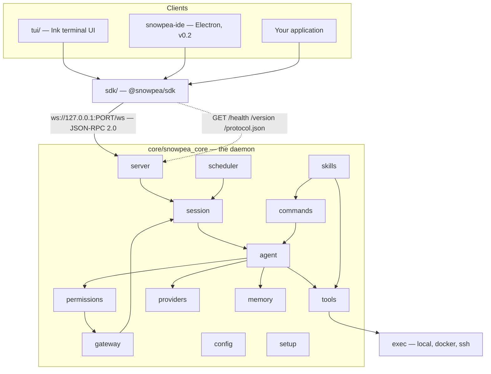
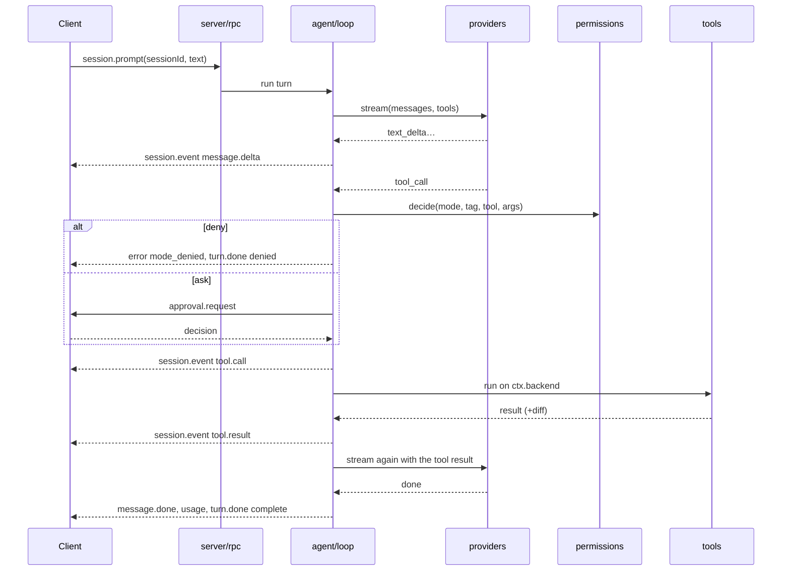

# Architecture

snowpea is one Python daemon and a set of thin clients. The daemon owns all state. Clients render it. Everything the daemon can do is a JSON-RPC method before it is a UI affordance, and the schema for those methods is generated from a single file.

Read [docs/protocol.md](protocol.md) for the generated reference, and [CONTRIBUTING.md](CONTRIBUTING.md) for how to work on any of this.

## The shape



## Module map

The package is `snowpea_core`, rooted at `core/snowpea_core/`.

| Module | Responsibility |
|---|---|
| `cli/main.py` | the `snowpea` console script: ensure a daemon, then spawn the TUI or run one headless turn |
| `cli/commands.py` | non-TUI subcommands — `setup`, `skill`, `service`, `daemon`, `agents`, `team`, `job`, `gateway`, `tools`, `commands`, `provider` |
| `server/app_server.py` | daemon bootstrap, the `Core` singleton, `daemon.json` |
| `server/transport_ws.py`, `transport_http.py` | one aiohttp app serving the WebSocket and the three read-only HTTP endpoints on one port |
| `server/rpc.py` | JSON-RPC 2.0 dispatcher, request/response correlation, server-to-client calls |
| `server/protocol.py` | **the single source of truth**: `PROTOCOL_VERSION`, every method and event schema |
| `server/auth.py`, `lifecycle.py` | token issue and check; idle timer, keepalive counters, shutdown reasons |
| `session/` | `Session` entities, SQLite persistence, history and compaction, the event hub and its per-session `seq` |
| `agent/loop.py` | the turn: prompt → provider stream → tool calls → results → repeat |
| `agent/subagent.py`, `team.py`, `named.py`, `definition.py` | delegation under a concurrency limit; worktree-per-worker team mode; persistent named agents; `agents/*.md` parsing and generation |
| `providers/` | eleven vendors behind `ChatProvider`; two native adapters, one OpenAI-compatible adapter, one preset table, one normalization point, a replay transport for tests |
| `tools/` | the tool registry and every built-in tool, plus search and browser provider registries and the MCP client |
| `exec/` | `ExecutionBackend` and its local, Docker and SSH implementations |
| `permissions/` | the mode × permission-tag matrix, the allowlist, the approval queue |
| `memory/` | SQLite FTS5 long-term memory, user profile, retrieval injection |
| `scheduler/` | cron, interval and natural-language jobs running inside the daemon |
| `gateway/` | Telegram, Discord and Slack adapters behind one router |
| `skills/` | the Claude Code plugin loader, `SKILL.md` parsing, hooks, marketplace search |
| `commands/registry.py` | **the only slash-command dispatcher**, merging built-ins, skills and plugin commands into one namespace |
| `config/` | `SNOWPEA_HOME` and project paths, global settings, project settings, credentials |
| `setup/` | the wizard, its screens and the option catalogue |
| `vendor/hermes/` | code copied from hermes-agent, byte-tracked against upstream plus committed patches |

Outside the package: `tui/` is the Ink UI and its esbuild bundle, `sdk/` is the TypeScript client, `scripts/` holds the generators and integrity checks, `installer/` holds the install scripts, `tests/` holds pytest suites and fixtures.

## Five rules the code follows

**The core owns all state.** Sessions, the approval queue, memory, schedules and gateway bindings live in the daemon. Clients are stateless renderers. This is why a TUI can disconnect and reconnect mid-turn, why a chat message and a terminal prompt reach the same session, and why the v0.2 IDE will need no core changes.

**Protocol first.** A capability that is not an RPC method does not exist. There is no private channel between the daemon and the TUI.

**One dispatcher for commands.** `commands/registry.py` is the only place a slash command is parsed and run. The TUI is a thin client: it fetches `command.list` on connect to build its palette and sends the raw text to `command.run`. That is why `/ralph` behaves identically in the terminal, in `snowpea -c`, in a scheduled job and in Telegram.

**Vendored code lives behind an adapter.** Code from hermes-agent sits in `vendor/hermes/` in its upstream shape and is only called through our own interfaces. The test is not byte-identity with upstream but traceable difference: upstream plus committed patch must equal the working copy, and CI checks it on every pull request.

**Every behaviour is observable.** Tool calls, approvals and subagent lifecycle all flow through `session.event` to attached clients and to `$SNOWPEA_HOME/logs/`. No path is allowed to be undebuggable.

## A turn, end to end



Every event carries a `seq` that increases monotonically within its session and is persisted before it is broadcast. A client that reconnects calls `session.resume(sessionId, afterSeq)` and is re-sent exactly what it missed. Turns stop at `agent.max_tool_rounds` (50); `session.interrupt` ends one with `turn.done{reason:"interrupted"}`.

## State on disk

| Path | Contents |
|---|---|
| `$SNOWPEA_HOME/daemon.json` | port, pid, token, startedAt, protocolVersion |
| `$SNOWPEA_HOME/token` | daemon auth token, mode `0600` |
| `$SNOWPEA_HOME/settings.json` | providers, search and browser choice, tool categories, limits, timeouts |
| `$SNOWPEA_HOME/credentials.json` | bot tokens and secrets, mode `0600` |
| `$SNOWPEA_HOME/state.db` | sessions, events, history, memories, jobs, job runs, team tasks, named agents |
| `$SNOWPEA_HOME/logs/daemon.log`, `approvals.jsonl` | operational log, and the audit trail of every approval decision |
| `$SNOWPEA_HOME/plugins/`, `skills/`, `agents/`, `commands/`, `marketplaces.json` | extensions |
| `<project>/.snowpea/settings.json` | `defaultMode`, allowlist, backend |
| `<project>/.snowpea/{skills,agents,commands}/`, `<project>/.claude/…` | project extensions |

`config/paths.py` honours `SNOWPEA_HOME` everywhere and hard-codes no global path, which is also what lets v0.2 bundle the core inside an Electron app: the core is startable with nothing but an executable path, a port and a token.

## Daemon lifecycle

The daemon is lazy-started by the first client and binds port 0, so the kernel picks the port and it is recorded rather than fixed. An idle timer (1800 seconds) shuts it down, but only when all four keepalive counters are zero: no open sessions, no enabled jobs, no gateway bindings, no named agents. `snowpea daemon status` prints the counters and the reason it will not exit.

Surviving a reboot is opt-in, through `snowpea service install` — a systemd user unit on Linux, a launchd agent on macOS, a logon scheduled task on Windows. Off by default, on purpose: installing a coding agent should not add a background service you did not ask for.

## Protocol versioning and the freeze gate

`server/protocol.py` holds `PROTOCOL_VERSION` as semver. `scripts/gen_protocol.py` generates `docs/protocol.md` and `sdk/src/protocol.ts`; both are artifacts and never hand-edited, and `--check` is a required CI job.

```bash
uv run python scripts/gen_protocol.py --check
uv run python scripts/gen_protocol.py --diff <tagA> <tagB>
```

Before the v0.2 IDE starts, the protocol has to pass a freeze gate: `PROTOCOL_VERSION == "1.0.0"`, no change to the generated schema across three consecutive release tags, and the SDK contract tests passing on all three. Failing the gate does not block v0.1 — it restarts the three-release count and pushes whatever forced the change back into the backlog.

After the freeze, additive change means a minor bump plus `capabilities` negotiation in `system.hello`. A major change means releasing every client together. Making that cost visible is the entire purpose of the gate.
